# Intrexx Installation Guide für Amazon Web Services (Linux/Windows Virtual Machines)

## Inhalt

1. [Data Center](#1)
2. [Virtual Private Cloud (VPC)](#2)
3. [Provisoning Instanz](#3)
4. [Datenbank Instanz](#4)
5. [AppServer Instanz](#5)
6. [Test](#6)
7. [Automatisierte Cloud-Installation](#7)
8. [Beschreibung der Playbooks und Ansible-Konfigurationsdateien](#8)

Die folgenden Kapitel beschreiben eine manuelle Minimal-Installation von Intrexx in einer AWS Cloud.
Für ein automatisch skalierbares Setup einer Intrexx Cloud siehe Kapitel [Automatisierte Cloud-Erzeugung](#7).

## Data Center

Nach Anmeldung an der AWS Konsole muss als erstes ein Datacenter gewählt werden.

*Achtung: Preise sind unterschiedlich!!!*

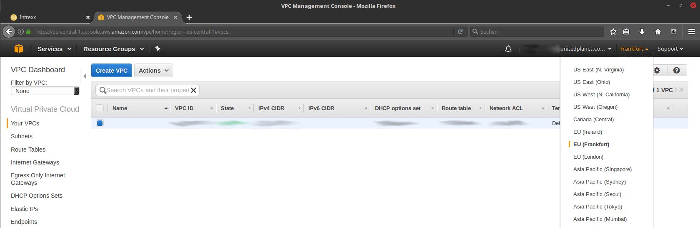

## Virtual Private Cloud (VPC)

Zunächst wird ein VPC erstellt.

### Start VPC Wizard

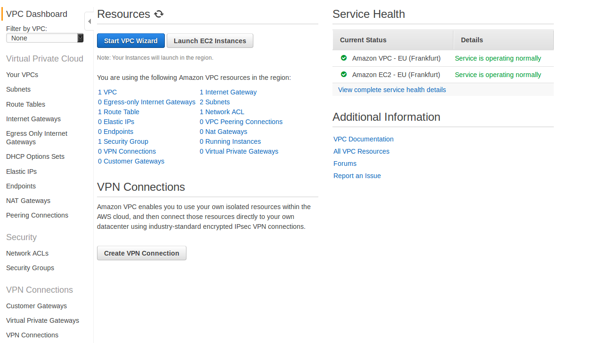

#### Single VPC Configuration

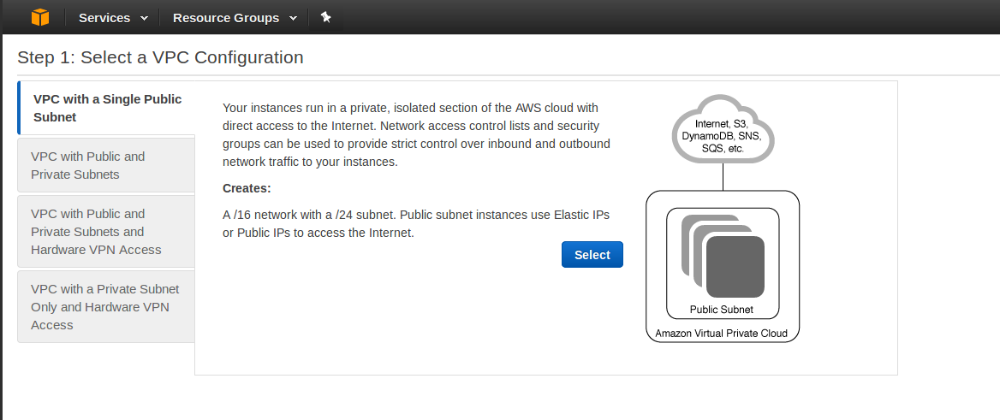

#### VPC with a Single Public Subnet

* IPv4 Address Range: 10.0.0.0/16
* VPC name: ixcloudvmtestvpc
* Public Subnet IPv4 Range: 10.0.0.0/24
* Subnet name: ixcloudvmtestvpcnet

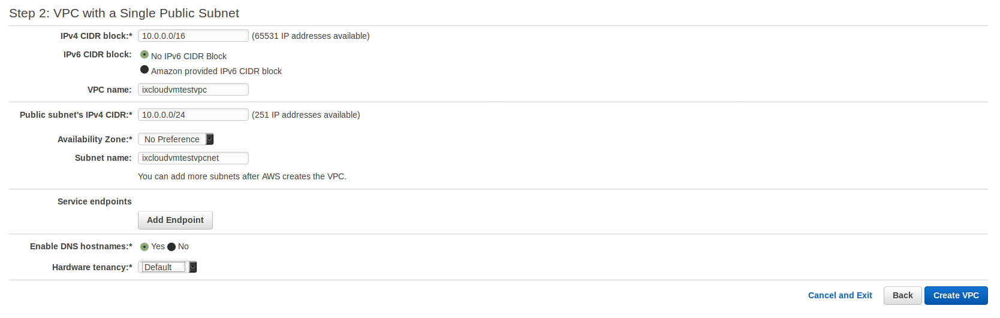

***=> Create VPC***

### Konfiguration prüfen

#### Subnet

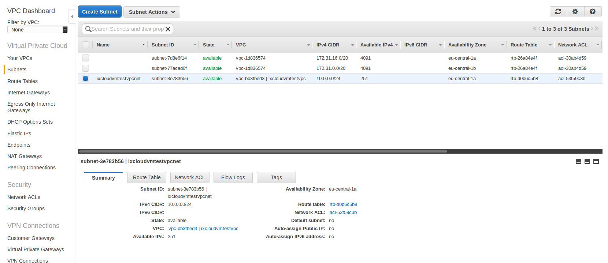

#### Route Tables - Routes

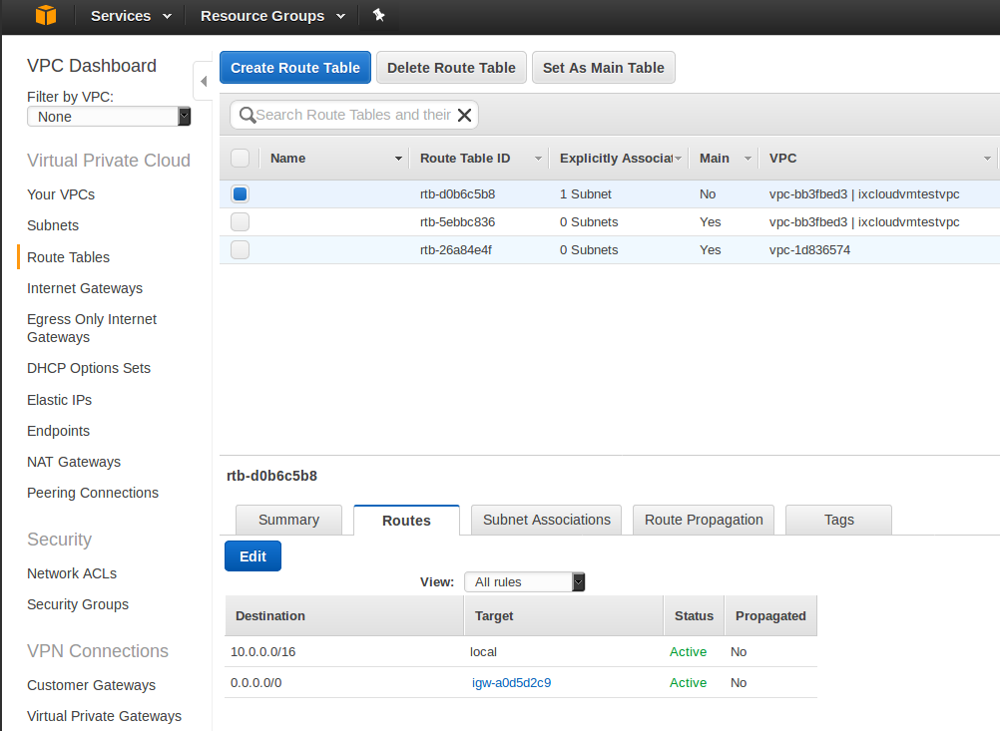

#### Route Tables - Subnet Associations

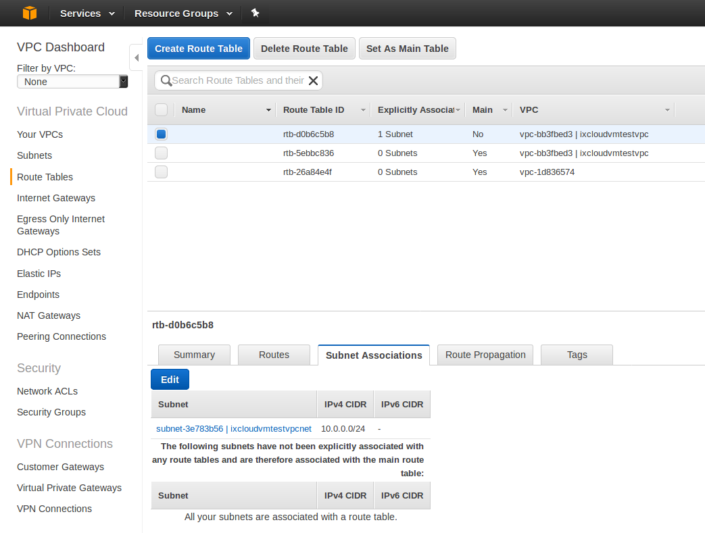

## Provisoning Instanz

Die "Provisoning Instanz" wird benötigt für die Verwaltung und Installation der Instanzen. Hier wird das aktuelle Setup gespeichert. Außerdem werden von dieser Instanz die Ansible Playbooks ausgeführt.

### Instanzkonfiguration

* Ubuntu Server 16.04 LTS (HVM), SSD Volume Type
* E2 Instanz Typ: t2.micro
* Network: ixcloudvmtestvpc
* Subnet: ixcloudvmtestvpcnet
* Public IP: ENABLE (Wird benbötigt für den Internetzugriff)
* Primary IP: 10.0.0.10
* Storage Size: 12GiB
* Add Tag: Key = name | Value = ixcloudprovisioning
* Security Group: Die unter VPC erstellte Security Group

#### OS Image

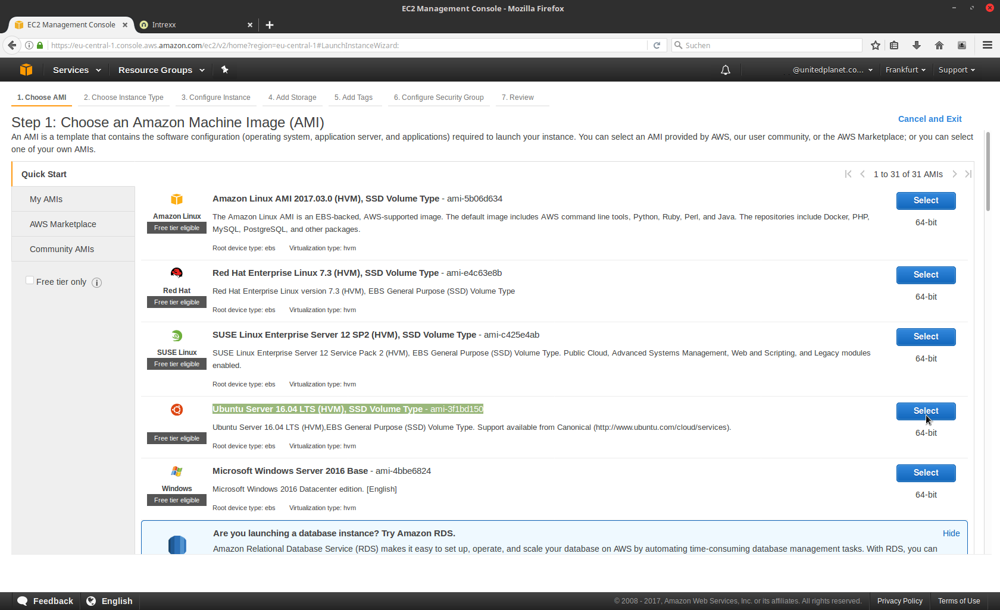

#### Typ

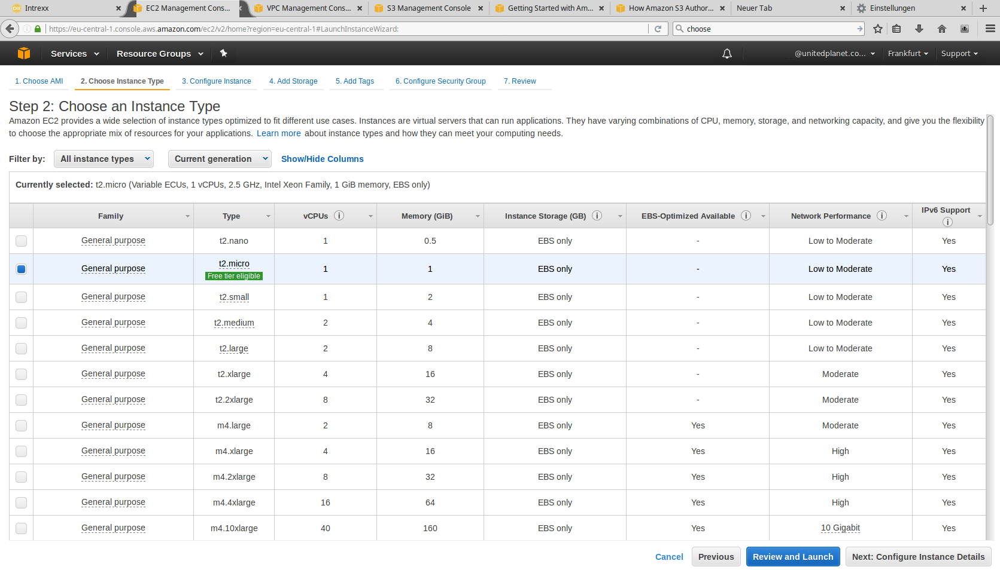

#### Network Details

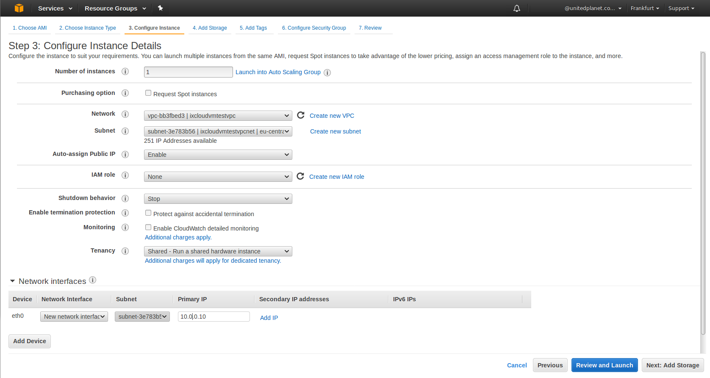

#### Storage

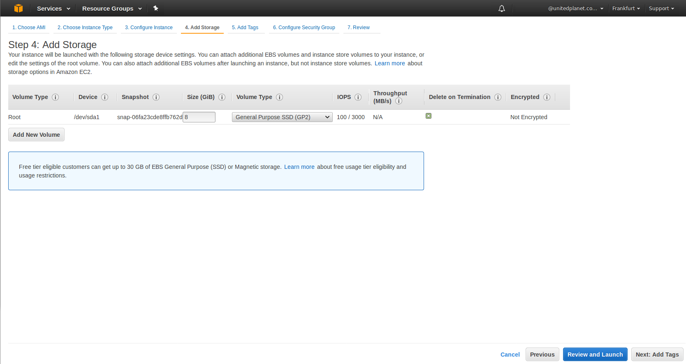

#### Tags

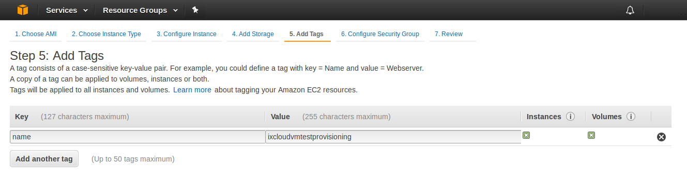

#### Security Group

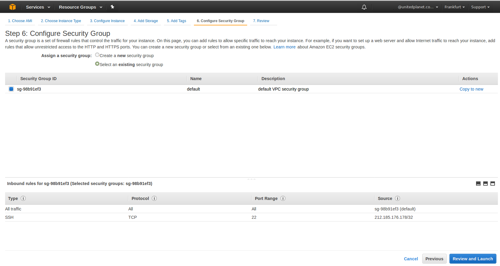

#### Summary & Launch

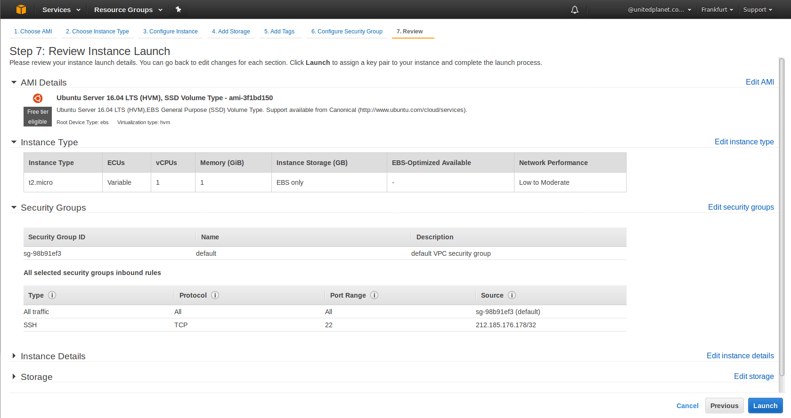

### SSH Key

Beim start einer Instanz wird abgefragt ob ein Key generiert werden soll.
Dieser wird benötigt um sich per ssh auf die Instanz zu verbinden.
Bei der Ersten Instanz muss ein neuer erzeugt werden, später kann dieser dann auch für andere Instanzen genutzt werden.

1. Name: ixcloudvmtest
2. Download Key
3. Umbennen von *.pem in id_rsa_aws
4. Verschieben nach ~/.ssh
5. unter .ssh eine config erstellen oder editieren ([public-ip] ersetzen durch die Public-IP der Instanz)

```bash
# contents of $HOME/.ssh/config
Host aws-fra
   HostName [public-ip]
   User ubuntu
   IdentityFile ~/.ssh/id_rsa_aws
```

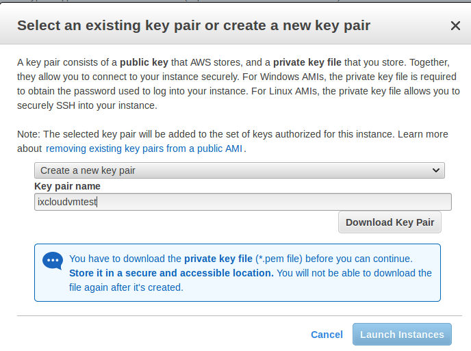

### Security Group Regeln

Unter der Security Group müssen die Ports freigegeben werden über welche auf das Cluster zugegriffen werden soll. Die Ports können für alle, nur die eigene IP, oder für die Instanzen innerhalb einer Security Group freigegeben werden.

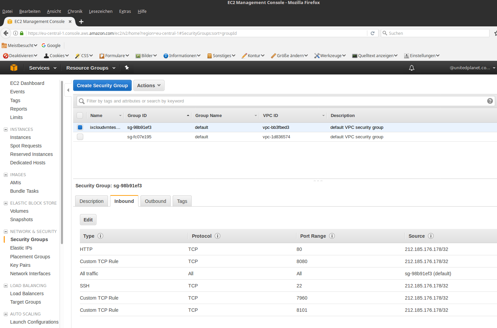

Innerhalb der Security Group werden alle Ports freigegeben:

* All traffic

Freizugebende Ports für Intrexx für die eigene IP oder nach außen:

* HTTP 80  INTREXX über NginX
* TCP 1337 INTREXX
* SSH 22   SSH
* TCP 8101 Manager

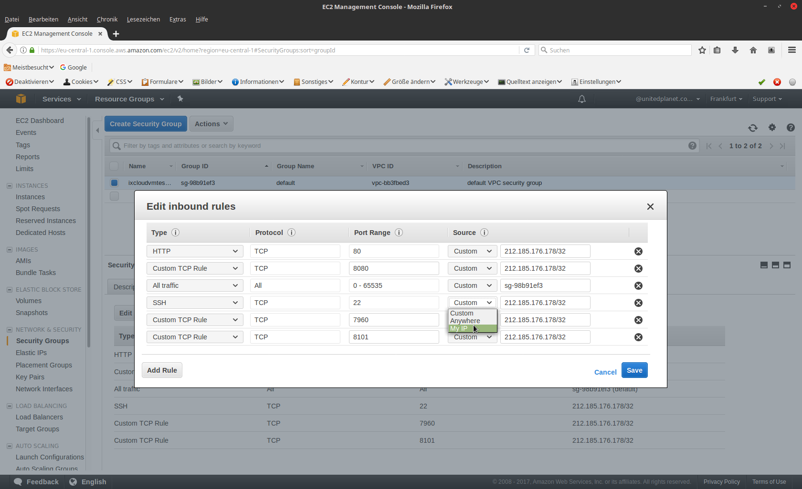

### Programme aktualisieren und installieren

**Im Terminal ausführen:**

Mit Provisioning Instanz verbinden:

```bash
ssh aws-fra
```

Update der Instanz:

```bash
sudo apt-get update
sudo apt-get upgrade
```

Installation python

```bash
sudo apt-get install python-minimal
sudo apt-get install python-pip
```

Installation Ansible & Module

```bash
apt-get install software-properties-common -y
apt-add-repository ppa:ansible/ansible -y
apt-get update
apt-get install git -y
apt-get install ansible -y
ansible-galaxy install geerlingguy.nginx
ansible-galaxy install geerlingguy.nfs
ansible-galaxy install geerlingguy.postgresql
```

Unzip installieren

```bash
sudo apt-get install p7zip-full
```

Neustart der Instanz

```bash
sudo reboot
```

### Setup & cloud-playbooks übertragen

**Im Terminal ausführen:**

* Playbooks entzippen

```bash
ssh aws-fra
```

```bash
unzip cloud-playbooks.zip
```

## Datenbank Instanz

Installation gleich wie bei der Provisioning Instanz.

### Installation im AWS

* Ubuntu Server 18.04 LTS (HVM), SSD Volume Type
* E2 Instanz Typ: t2.micro
* Network: ixcloudvmtestvpc
* Subnet: ixcloudvmtestvpcnet
* Public IP: ENABLE (Wird benbötigt für den Internetzugriff)
* Primary IP: 10.0.0.14
* Storage Size: 16GiB
* Add Tag: Key = name | Value = ixclouddb
* Security Group: Die unter VPC erstellte Security Group

### System aktualisieren

**Im Terminal ausführen:**

Mit Provisioning Instanz verbinden:

```bash
ssh aws-fra
```

Mit AppServer verbinden

```bash
ssh 10.0.0.14
```

Update der Instanz:

```bash
sudo apt-get update
sudo apt-get upgrade
```

Installation python

```bash
sudo apt-get install python-minimal
```

Neustart der Instanz

```bash
sudo reboot
```

## AppServer Instanz

Diese Installation wird 3 mal durchgeführt:

* AppServer Services: IP = 10.0.0.15 (SERVICES)
* AppServer Portal 1: IP = 10.0.0.16 (Portal1)
* AppServer Portal 2: IP = 10.0.0.17 (Portal2)
* Ubuntu Server 18.04 LTS (HVM), SSD Volume Type
* E2 Instanz Typ: t2.medium
* Network: ixcloudvmtestvpc
* Subnet: ixcloudvmtestvpcnet
* Public IP: ENABLE (Wird benbötigt für den Internetzugriff)
* Primary IP: 10.0.0.<15/16/17>
* Storage Size: 12GiB
* Add Tag: Key = name | Value = IxCloudVMTest
* Security Group: Die unter VPC erstellte Security Group


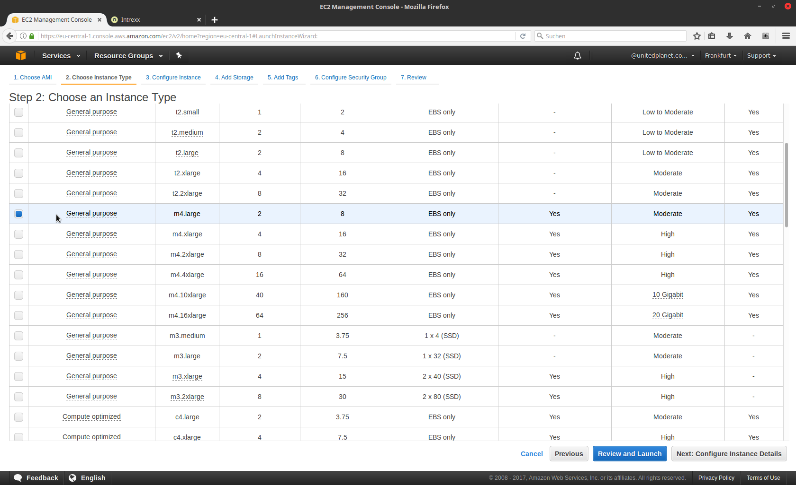
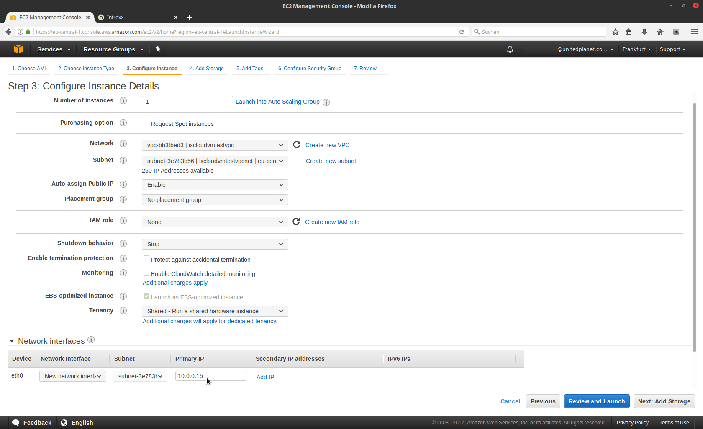
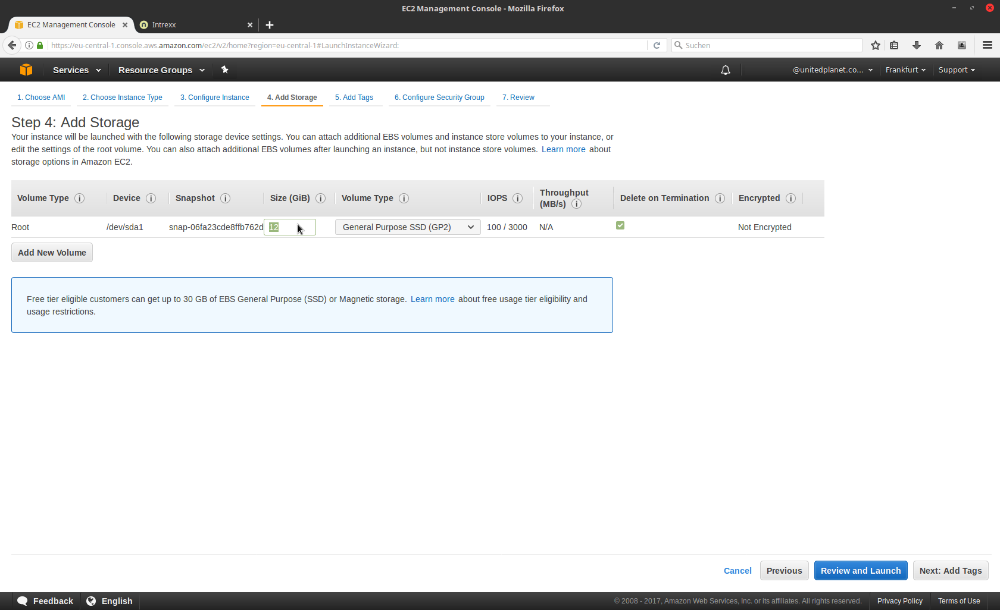
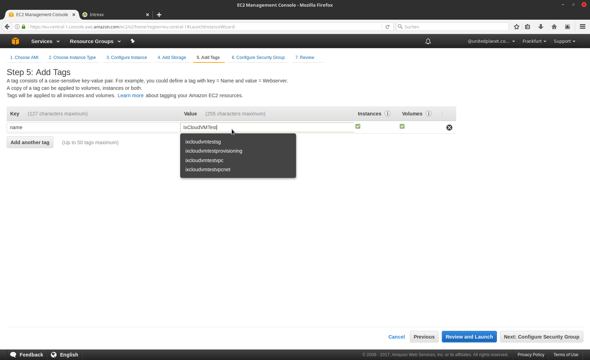
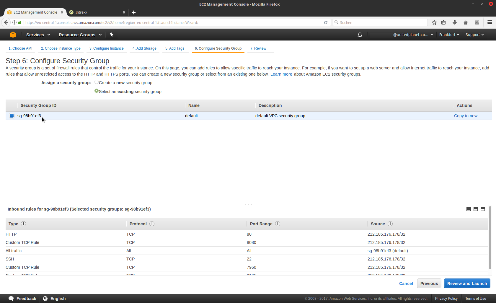

**Im Terminal ausführen:**

Mit Provisioning Instanz verbinden:

```bash
ssh aws-fra
```

Mit AppServer verbinden

```bash
ssh 10.0.0.<15/16/17>
```

Update der Instanz:

```bash
sudo apt-get update
sudo apt-get upgrade
```

Installation python

```bash
sudo apt-get install python-minimal
```

Neustart der Instanz

```bash
sudo reboot
```

## Installation der Playbooks

Die asible Playbooks werden auf der Provisioning Instanz gestartet (10.0.0.10)

**Im Terminal ausführen:**

Mit Provisioning Instanz verbinden:

```bash
ssh aws-fra
```

* Datenbank Instanz

```bash
ansible-playbook -v -i hosts_aws dbserver.yml
```

* Dateiserver Instanz

```bash
ansible-playbook -v -i hosts_aws fileserver.yml
```

* AppServer Services

```bash
ansible-playbook -v -i hosts_aws appserver_services.yml
```

* AppServer 1-3 Portal

```bash
ansible-playbook -v -i hosts_aws appserver_portal.yml
```

* NginX

NginX wird auf der Services Instanz installiert und betrieben. (IP: 10.0.0.15)

```bash
ansible-playbook -v -i hosts_aws loadbalancer.yml
```

## Test

Nun sollte Intrexx über die Public DNS der IxServices Instanz erreichbar sein.


## Automatisierte Cloud-Installation

### Hinweis

Eine aktuelle Version der Installationsskripte für AWS und Azure befinden sich [hier](../../installer/docs/README.md).

## Beschreibung der Playbooks und Ansible-Konfigurationsdateien

### Verzeichnissstrucktur "cloud-playbooks"

* files => In diesem Ordner liegen Dateien, die für das Intrexx Setup benötigt werden
* appserver.yml => Startet appserver_services.yml & appserver_portal.yml Playbooks
* appserver_services.yml => Playbook erstellt den Services AppServer
* appserver_portal.yml => Playbook erstellt die Portal AppServer
* appserver_restart.yml => Startet die AppServer neu
* dbserver.yml => Playbook erstellt Datenbank Server mit Postgres Datenbank
* fileserver.yml => Playbook erstellt Dateiserver mit NFS
* hosts => Hier werden die Hosts definiert, ink. der IP Adressen
* loadbalancer.yml => Playbook zum erstellen  des NginX Servers
* site.yml => Startet appserver.yml & dbserver.yml Playbooks (Gesammter Cluster wird erstellt)
* vars.yml => Hier werden die Variablen für die anderen Playbooks definiert. z.B.: Postgres Zugangsdaten, NginX Settings

### appserver_services.yml

Wichtige Variablen:

* remote_user => Linux-User der Instanz

Playbook Ablauf:

1. Änderung der /etc/host
2. Installation und Anlegen der NFS-Pattion unter dem Pfad /share (Verteilte Festplatte)
3. Kopieren und Entpacken des Setups.
4. Intrexx installation
5. Portal installation auf dem /share Verzeichniss
6. Stop der Intrexx-Dienste
7. Kopieren und Ersetzten der Dateien aus ./files
8. Start der DB-/Datei-/Such-Server-Dienste

### appserver_portal.yml

Wichtige Variablen:

* remote_user => Linux-User der Instanz

Playbook Ablauf:

1. Änderung der /etc/host
2. Installation des NFS Dienst und mount der NFS-Pattion unter dem Pfad /share (Verteilte Festplatte)
3. Kopieren und Entpacken des Setups.
4. Intrexx installation
5. Stop der Intrexx-Dienste
6. Kopieren und Ersetzten der Dateien aus ./files
7. Start des Intrexx-Dienstes (Portalserver)

### hosts

Definiton der Hosts/Instanzen, inklusive der IP-Adressen, die in den Playbooks verwendet werden.
Definiert auf welchen Instanzen die entsprechenden Playbooks abgespielt werden.

### vars.yml

Definitionen:

* Postgres
  * Version
  * Encoding
  * DB-Owner
  * IP-Adresse
  * Subnetz
  * Zugangsdaten
    * Name
    * Passwort
    * Verschlüsselt
  * User Rechte
* NFS exports
* NginX
  * name
  * Strategie
  * Server IP-Adressen
  * vHost
