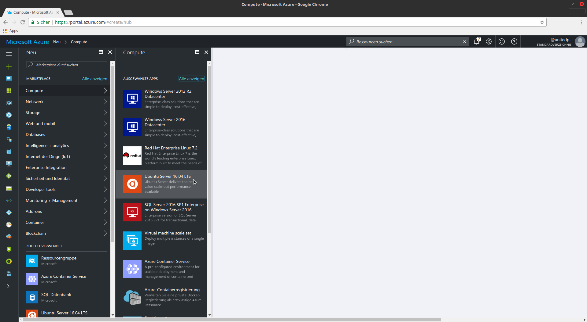
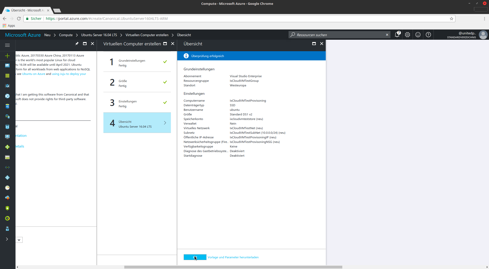
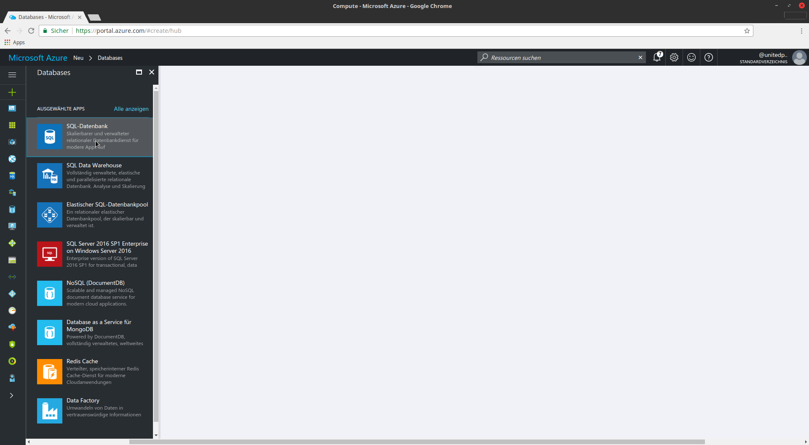
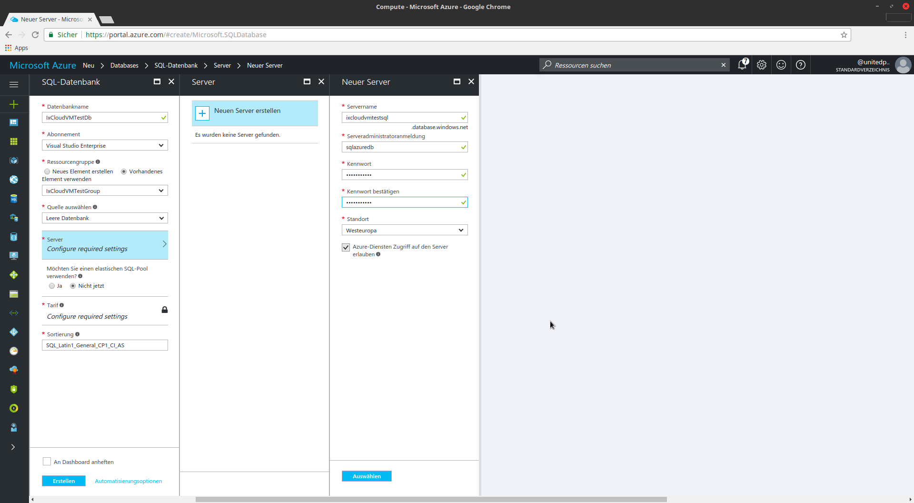
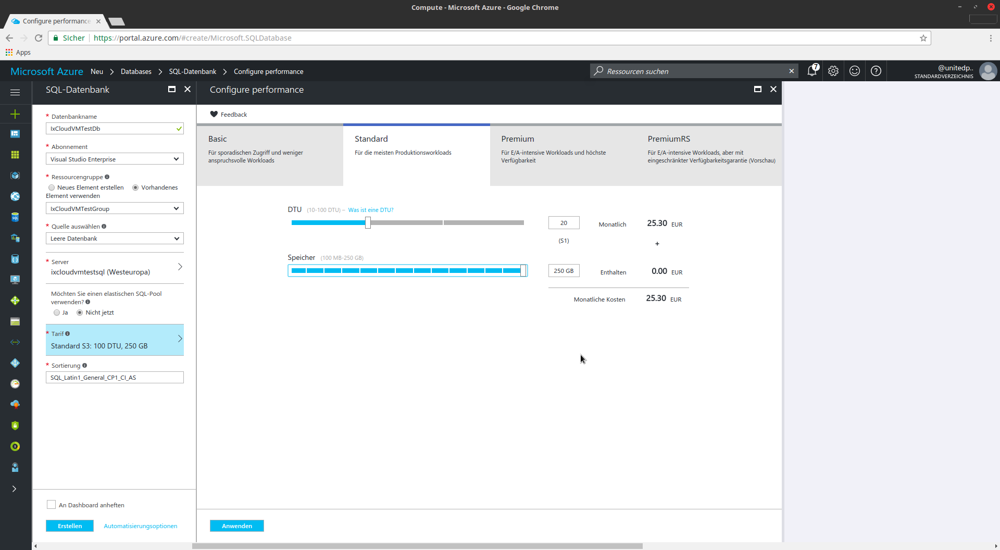

# Intrexx Cloud Installation Guide für Microsoft Azure (Ubuntu Linux Virtual Machines)

Dieser Installationsleitfaden beschreibt eine Intrexx Cloud Installation mit 3 Virtual Machine Instanzen in der Microft Azure Cloud. Für die Installation/Provisionierung der Instanzen kommen Ansible Playbooks zum Einsatz.

Für eine vollautomatisierte Installation auf AWS und Azure gibt es eine CLI Installationsroutine. Siehe [hier](../../installer/docs/README.md).

## Inhalt

- [Intrexx Cloud Installation Guide für Microsoft Azure (Ubuntu Linux Virtual Machines)](#intrexx-cloud-installation-guide-f%C3%BCr-microsoft-azure-ubuntu-linux-virtual-machines)
  - [Inhalt](#inhalt)
  - [Ressourcen Gruppe erstellen](#ressourcen-gruppe-erstellen)
  - [Provisoning Instanz](#provisoning-instanz)
    - [Installation Azure](#installation-azure)
    - [Programme aktualisieren und installieren](#programme-aktualisieren-und-installieren)
    - [Setup & cloud-playbooks übertragen](#setup--cloud-playbooks-%C3%BCbertragen)
  - [Datenbank Instanz](#datenbank-instanz)
  - [AppServer Instanz](#appserver-instanz)
    - [Installation im Azure](#installation-im-azure)
    - [System aktualisieren](#system-aktualisieren)
  - [SecurityGroup Einstellungen](#securitygroup-einstellungen)
    - [Freizugebene Ports](#freizugebene-ports)
  - [Installation der Playbooks](#installation-der-playbooks)
    - [AppServer SERVICES](#appserver-services)
    - [AppServer 1-2 Portal](#appserver-1-2-portal)
    - [NginX](#nginx)
  - [Test](#test)
  - [9. Beschreibung der Playbooks und Ansible Konfigurations Dateien](#9-beschreibung-der-playbooks-und-ansible-konfigurations-dateien)
    - [Verzeichnissstrucktur "cloud-playbooks"](#verzeichnissstrucktur-%22cloud-playbooks%22)
    - [vars.yml](#varsyml)
    - [appserver_services.yml](#appserverservicesyml)
    - [appserver_portal.yml](#appserverportalyml)
    - [hosts](#hosts)
  - [Automatische Installation](#automatische-installation)

## Ressourcen Gruppe erstellen

Eine Ressourcengruppe organisiert in Azure die benötigten Cloud Elemente. Zunächst wird eine Ressourcengruppe `IxCloudVMTestGroup` angelegt.


## Provisoning Instanz

Die "Provisoning Instanz" wird benötigt für die Verwaltung und Installation der Instanzen. Hier wird das aktuelle Intrexx Setup hochgeladen. Außerdem werden von dieser Instanz die Ansible Playbooks ausgeführt.

### Installation Azure

**Ubuntu Image wählen:**



**Grundeinstellungen**\
Name: IxCloudVMTestProvisioning\
Username: ubuntu\
Public ssh Key aus ~/.ssh/id_rsa.pub kopieren und einfügen.\
Resourcgengruppe: IxCloudVMTestGroup


**Größe wählen:**\


**Speicherkonto erstellen:**\
Dieses Speicherkonto wird von allen Instanzen genutzt\
Name: ixcloudvmteststore


**Virtuelles Netzwerk erstellen**\
Dieses Netzwerk wird von allen Instanzen genutzt\
Name:IxCloudVMTestNet\
Adressbereich: 10.0.0.0/24\
Subnetzname: IxCloudVMTestSubNet\
Adressbereich: 10.0.0.0/24\

Öffentliche Ip:  IxCloudVMTestProvisioningIp


**Sicherheitsgruppe erstellen**\
Diese Sicherheits gruppe wird von allen Instanzen verwendet.\
Name: IxCloudVMTestProvisioningNSG\
SSH Freigeben\
Später folgen weitere Regeln\

**Speichern und Anlegen**\
OK



### Programme aktualisieren und installieren

**Im Terminal ausführen:**
Mit Provisioning Instanz verbinden:

```bash
ssh ubuntu@publicIPAdress
```

Update der Instanz:

```bash
sudo apt-get update
sudo apt-get upgrade
```

Installation python

```bash
sudo apt-get install python-pip
```

Installation Ansible & Module

```bash
apt-get install software-properties-common -y
apt-add-repository ppa:ansible/ansible -y
apt-get update
apt-get install git -y
apt-get install ansible -y
ansible-galaxy install geerlingguy.nginx
ansible-galaxy install geerlingguy.nfs
ansible-galaxy install geerlingguy.postgresql
```

Unzip installieren

```bash
sudo apt-get install p7zip-full
```

Neustart der Instanz

```bash
sudo reboot
```

### Setup & cloud-playbooks übertragen

**Im Terminal ausführen:**

* Playbooks entzippen

```bash
ssh ubuntu@publicIPAdress
unzip cloud-playbooks.zip
```

## Datenbank Instanz

Für die Datenbank wird eine Microsoft SQL Datenbank verwendet.


**Einstellungen:**
Datenbankname: IxCloudVMTestDb
Ressourcengruppe:IxCloudVMTestGroup
Server:

* Name: ixcloudvmtestsql
* Administratoranmeldung: intrexx
* Kennwort: 1MyIxCloud!

Werden andere Datenbanken/Einstellungen als die obigen verwendet, müssen diese Einstellungen in der Datei vars.yml angepasst werden.



**Tarif**\


## AppServer Instanz

Diese Installation wird 3 mal durchgeführt:

* AppServer1: IP = 10.0.0.5 (SERVICES)
* AppServer2: IP = 10.0.0.6 (Portal)
* AppServer3: IP = 10.0.0.7 (Portal)

### Installation im Azure

Exemplarisch für alle Instanzen:\
Lediglich eine Instanz braucht eine Public Ip für den Portal Manager Zugang.

Name: IxCloudVMTestApp1/2/3\
Username: ubuntu\
SSH-Key: Auf Provisioning Instanz erzeugen mit

```bash
ssh-keygen -t rsa
```

Anschliessend `id_rsa.pub` Inhalt kopieren und einfügen.

Resourcengruppe: IxCloudVMTestGroup\


VirtuellesNetzwerk, Subnetz, Netzwerksicherheitsgruppe kann von Provisioning übernommen werden.\
Öffentliche IP-Adresse: Wird nur von einer der 6 Instanzen benötigt.

Hohe Verfügbarkeit:

* Neue Erstellen
* Name: IxCloudVMTestAvailGrp
* Fehlerdomäne: 1
* Updatedomäne: 1


Diagnose: Deaktivieren.


**Anlegen**\
OK


### System aktualisieren

**Im Terminal ausführen:**

Mit Provisioning Instanz verbinden

```bash
ssh ubuntu@publicIPAdress
```

Mit AppServer verbinden

```bash
ssh 10.0.0.<5/6/7>
```

Update der Instanz

```bash
sudo apt-get update
sudo apt-get upgrade
```

Neustart der Instanz

```bash
sudo reboot
```

## SecurityGroup Einstellungen

### Freizugebene Ports

* HTTP 80 INTREXX über NginX
* TCP 1337 INTREXX
* SSH 22 SSH
* TCP 8101 MANAGER


## Installation der Playbooks

Die Ansible Playbooks werden auf der Provisioning Instanz gestartet (10.0.0.4)

**Im Terminal ausführen:**

Mit Provisioning Instanz verbinden:

```bash
ssh ubuntu@publicIPAdress
```

### AppServer SERVICES

```bash
ansible-playbook -v -i hosts_azure appserver_services.yml
```

### AppServer 1-2 Portal

```bash
ansible-playbook -v -i hosts_azure appserver_portal.yml
```

### NginX

NginX wird auf dem AppServer2 installiert und betrieben.

```bash
ansible-playbook -v -i hosts_azure loadbalancer.yml
```

## Test

Nun sollte Intrexx über die Private-/Public-IP der IxServices (Nginx) Instanz erreichbar sein.

```bash
curl http://10.0.0.5:1337/default.ixsp
```

## 9. Beschreibung der Playbooks und Ansible Konfigurations Dateien

### Verzeichnissstrucktur "cloud-playbooks"

* files => In diesem Ordner liegen u.a. Dateien, die nach dem Setup ersetzt werden müssen.
  * configuration.properties.j2: Intrexx Setup Konfiguration.
  * portal.config.j2: Intrexx Portal Konfiguration.
* appserver.yml => Startet appserver_services.yml & appserver_portal.yml Playbooks
* appserver_services.yml => Playbook erstellt die Services Instanz.
* appserver_portal.yml => Playbook erstellt Portalserver Instanzen.
* appserver_restart.yml => Startet die Appserver neu.
* dbserver.yml => Playbook erstellt Datenbank Server mit Postgres Datenbank. Wird für die Konfiguration mit dem MS SQL Server nicht benötigt.
* fileserver.yml => Playbook erstellt NFS Dateiserver.
* loadbalancer.yml => Playbook erstellt Nginx Loadbalancer. Wird nicht benötigt, wenn ein Cloud Provider Loadbalancer verwendet wird.
* hosts => Hier werden die Hosts definiert, inkl. der IP Adressen.
* site.yml => Startet appserver.yml & dbserver.yml Playbooks (Gesammter Cluster wird erstellt)
* vars.yml => Hier werden die Variablen für die andern Playbooks definiert. z.B.: Postgres Zugangsdaten, NginX Settings
* systemcare.yml => Nur Linux: Kopiert alle Portalserver Log-Dateien von allen Instanzen in ein lokales Verzeichnis.

### vars.yml

Hier werden alle wichtigen Einstellungen des Intrexx Clusters definiert.

### appserver_services.yml

Playbook Ablauf:

1. Änderung der /etc/host
2. Installation und Anlegen der NFS-Partition unter dem Pfad /share (Geteiltes Dateisystem)
3. Kopieren und Entpacken des Setups.
4. Intrexx installation
5. Portal installation auf dem /share Verzeichniss
6. Stop der Intrexx-Dienste
7. Kopiert /opt/intrexx/cfg nach /share/cfg
8. Löscht /opt/intrexx/cfg
9. Symbolischer Link: /opt/intrexx/cfg --> /share/cfg
10. Kopieren und Ersetzten der Dateien aus ./files
11. Beenden der Intrexx-Dienste und Start des Postgres/NFS/Solr Servers.

### appserver_portal.yml

Playbook Ablauf:

1. Änderung der /etc/host
2. Installation des NFS Dienstes und mounten der NFS-Partition unter dem Pfad /share
3. Kopieren und Entpacken des Setups.
4. Intrexx Installation
5. Stop der Intrexx-Dienste
6. Löscht /opt/intrexx/cfg
7. Symbolischer Link: /opt/intrexx/cfg --> /share/cfg
8. Kopieren und Ersetzen der Dateien aus ./files
9. Start des Intrexx-Dienstes (Portalserver)

### hosts

Definiton der Hosts/Instanzen, inkl. der IP-Adressen, die in den Playbooks verwendet werden.
Definiert, auf welchen Instanzen die entsprechenden Playbooks abgespielt werden.

```bash
[appserver_services]
10.0.0.5 hostname=IxCloudVMTestServices ipaddr=10.0.0.5

[appserver_portal]
10.0.0.6 hostname=IxCloudVMTestApp1 ipaddr=10.0.0.6
10.0.0.7 hostname=IxCloudVMTestApp2 ipaddr=10.0.0.7
10.0.0.8 hostname=IxCloudVMTestApp3 ipaddr=10.0.0.8

[nginx]
10.0.0.5 hostname=IxCloudVMTestServices ipaddr=10.0.0.5
```

## Automatische Installation

Für eine vollautomatisierte Installation auf AWS und Azure gibt es eine CLI Installationsroutine. Siehe [hier](../../installer/docs/README.md).
