# Intrexx Cloud Installation Guide für Microsoft Azure (MS Windows Server Virtual Machines)

Dieser Installationsleitfaden beschreibt eine Intrexx Cloud Installation mit Windows Server 2016 Virtual Machine Instanzen in der Microft Azure Cloud. Für die Installation/Provisionierung der Instanzen kommen Ansible Playbooks zum Einsatz.

## Ressourcen Gruppe erstellen

Eine Ressourcengruppe organisiert in Azure die benötigten Cloud Elemente. Zunächst wird eine Ressourcengruppe `IxWinCloud` angelegt.

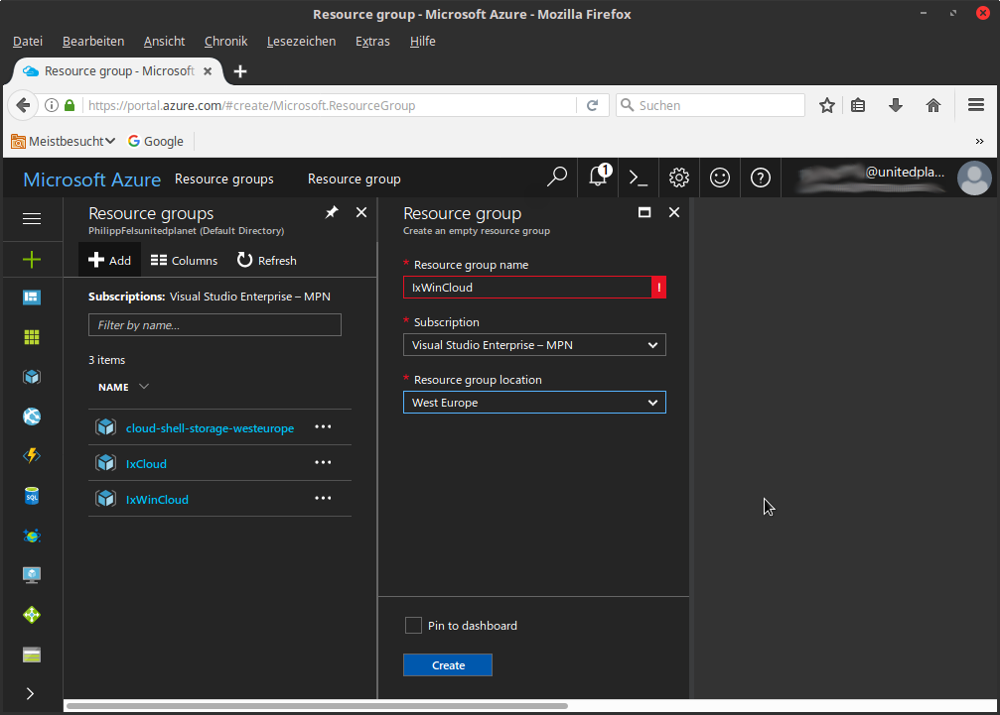

## Linux Provisioning Instanz

Die "Provisoning Instanz" wird benötigt für die Verwaltung und Installation der Instanzen. Hier wird das aktuelle Intrexx Setup und die Setup Skripte/Ressourcen hochgeladen. Außerdem werden von dieser Instanz die Ansible Playbooks ausgeführt.

### 2.1 Installation Azure

**Ubuntu Image wählen:**

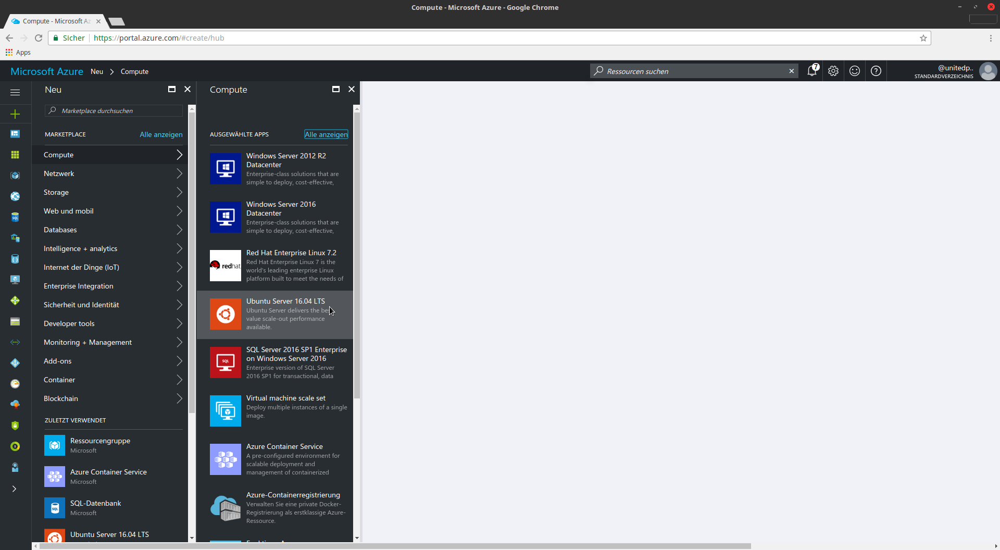

**Grundeinstellungen**\
Name: ProvisioningWin\
Username: ubuntu\
Public ssh Key aus ~/.ssh/id_rsa.pub kopieren und einfügen.\
Resourcgengruppe: IxWinCloud

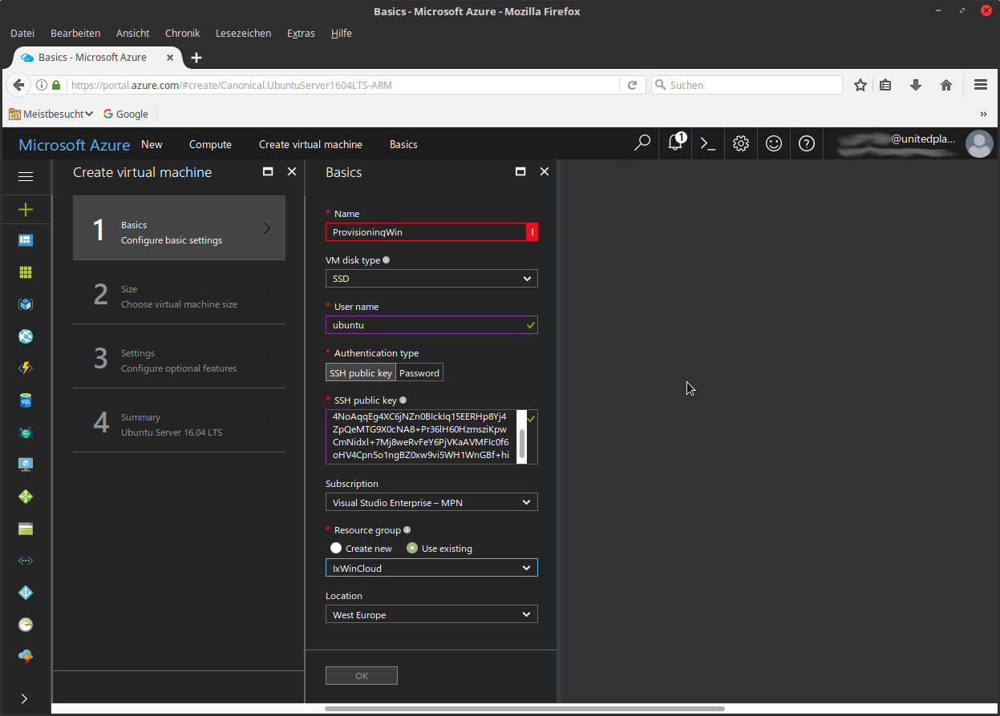

**Größe wählen:**\

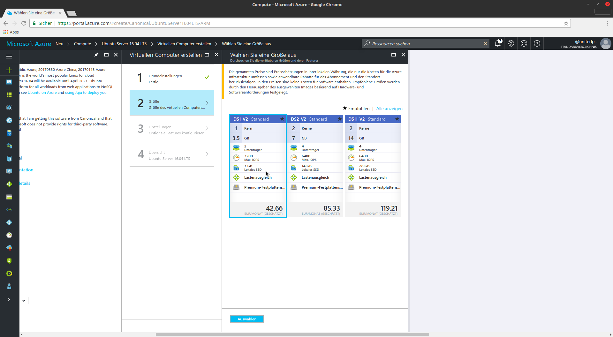

**Virtuelles Netzwerk erstellen**\
Dieses Netzwerk wird von allen Instanzen genutzt\
Name:IxWinCloudNet\
Adressbereich: 10.0.1.0/24\
Subnetzname: IxWinCloudSubNet\
Adressbereich: 10.0.1.0/24\

Öffentliche Ip: IxProvisioningWinIP
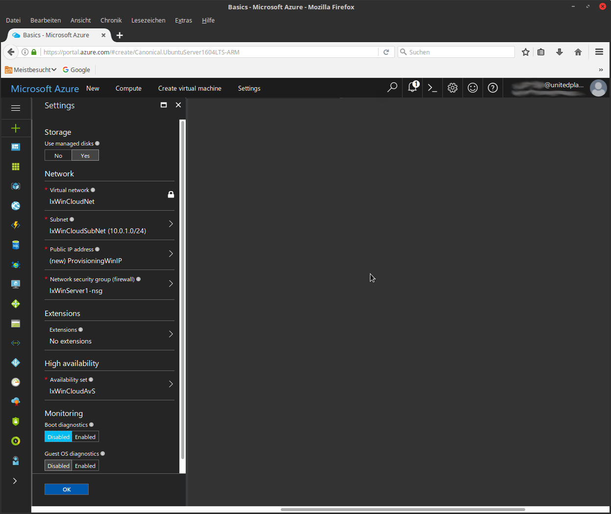

**Sicherheitsgruppe erstellen**\
Diese Sicherheits gruppe wird von allen Instanzen verwendet.\
Name: IxWinServer1-nsg\
SSH Freigeben\
Später folgen weitere Regeln\

**Speichern und Anlegen**\
OK
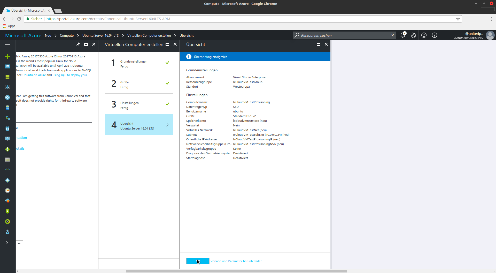

### 3. Programme aktualisieren und installieren

**Im Terminal ausführen:**
Mit Provisioning Instanz verbinden:

```bash
ssh ubuntu@publicIPAdress
```

Update der Instanz:

```bash
sudo apt-get update
sudo apt-get upgrade
```

Installation python

```bash
sudo apt-get install python-pip
pip install pywinrm
pip install pywinrm[credssp]
```

Installation Ansible

```bash
apt-get install software-properties-common -y
apt-add-repository ppa:ansible/ansible -y
apt-get update
apt-get install git -y
apt-get install ansible -y
ansible-galaxy install geerlingguy.nginx
```

### Cloud-playbooks & Intrexx auf die Provisioning Maschine übertragen

* Intrexx Download: `wget https://download.unitedplanet.com/intrexx/90000/intrexx-18.09.1-windows-x86_64.zip`
* Download entpacken und Ordner `IX_18.09` nach `./professional` umbenennen.
* Den Ordner des aktuellen Intrexx Setups muss gezippt werden zu `professional.zip`.

```bash
scp cloud-playbooks.zip ubuntu@provisioningIp:
```

```bash
scp professional.zip ubuntu@provisioningIp:
```

## 4 Installation Azure Windows Server Instanzen

### Windows Server 2016 Image wählen

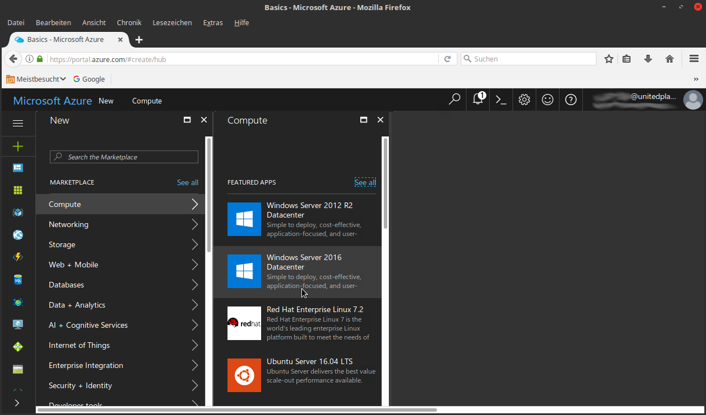

### Windows Server 2016 Einstellungen

**Name:** 1 x IxServices und n x IxAppServer<1,2,3,4,5,...>\
**VM disk type:** SSD\
**User:** win\
**Password:** Winpw2017!!!\
**Resource group:** IxWinCloud
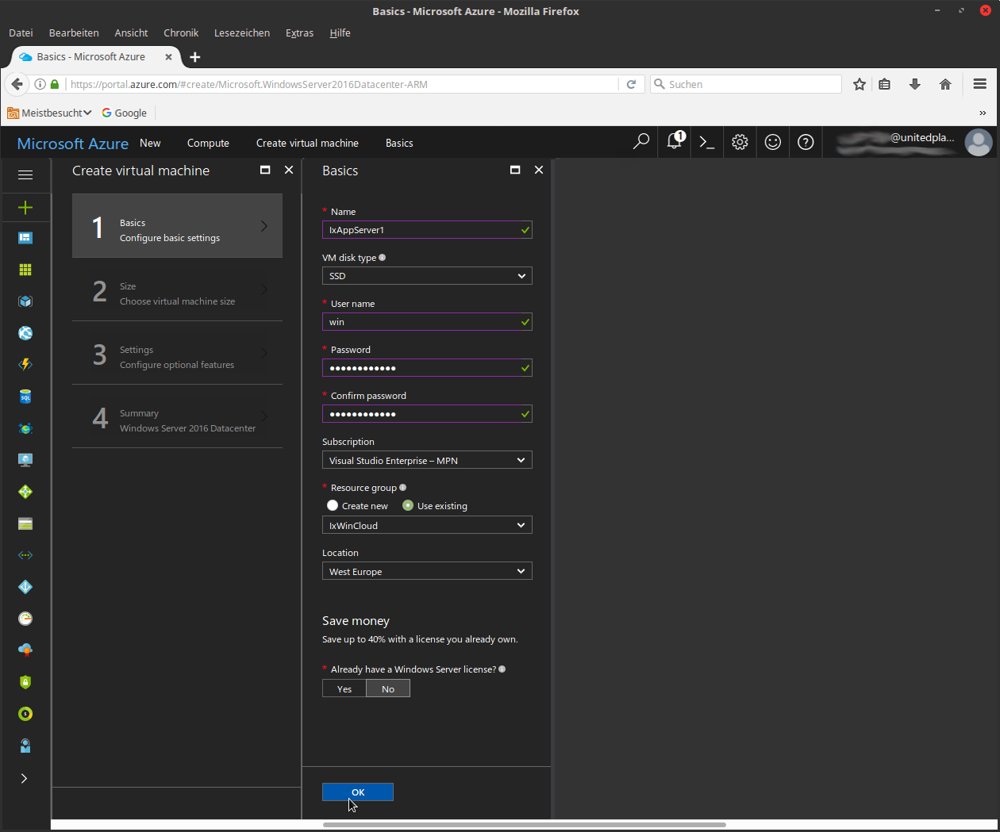

### Größe wählen

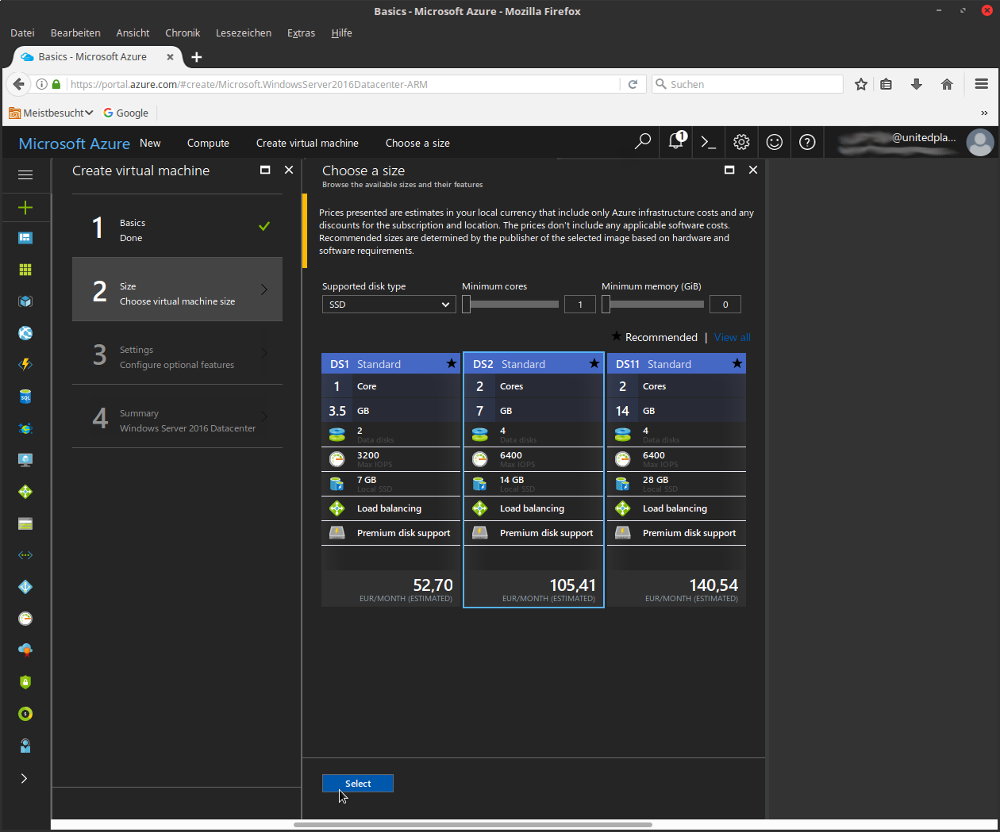

### Einstellungen

**Virtuelles Netzwerk:**\
Dieses Netzwerk wird von allen Instanzen genutzt\
Name:IxCloudVMTestNet\
Adressbereich: 10.0.1.0/24\
Subnetzname: IxCloudVMTestSubNet\
Adressbereich: 10.0.1.0/24
Öffentliche Ip:  IxCloudVMTestProvisioningIp

**Sicherheitsgruppe:**\
Diese Sicherheitsgruppe wird von allen Instanzen verwendet.\
Name: IxWinServer1-nsg\

**Public Ip Adresse:**\
Wird benötigt für den Zugriff per RDP auf die Instanz.\
Kann später deaktiviert werden

**Availibility set**\
IxWinCloudAvS

**Speichern und Anlegen**\
OK
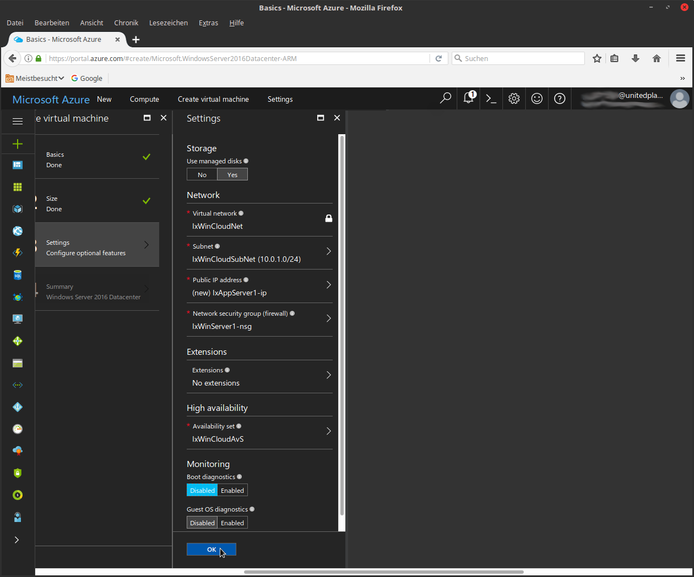

## 5 Instanzen aktualisieren und installieren

Zunächst in Azure ein Fileshare für das Intrexx Setup anlegen. Auf dieses das `professional.zip` kopieren.

Via RDP mit den Windows Instanzen verbinden. Windows Updates installieren.

## 6 Datenbank Instanz

Für die Datenbank wird eine Microsoft SQL Datenbank verwendet.
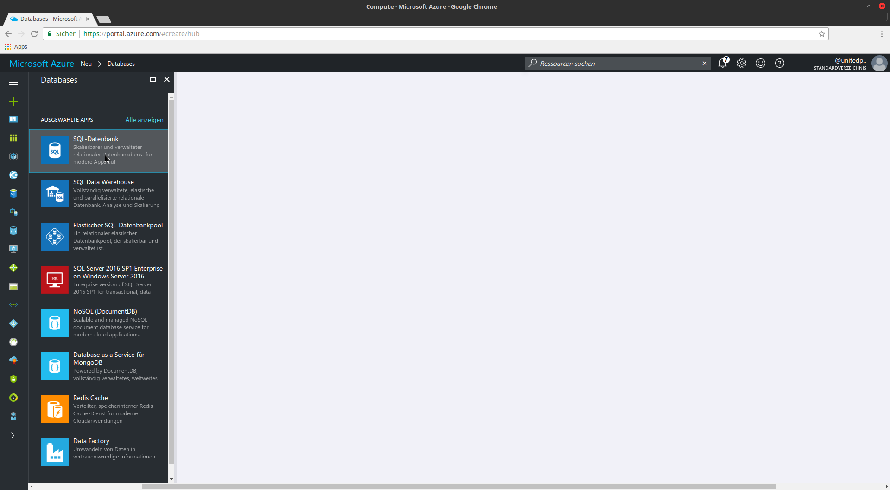

**Einstellungen:**\
Datenbankname: IxCloudVMTestDb\
Ressourcengruppe:IxWinCloud\
Server:\

* Name: ixcloudvmtestsql
* Administratoranmeldung: intrexx
* Kennwort: 1MyIxCloud!

Werden andere Datenbanken/Einstellungen als die obigen verwendet, muss die Intrexx Portal Konfigurationsdatei unter windows/vars.yml angepasst werden.

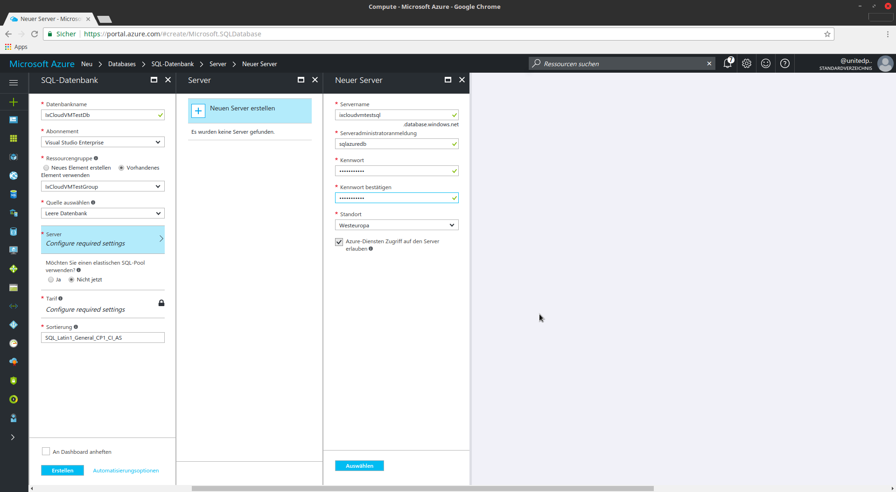

**Tarif**\
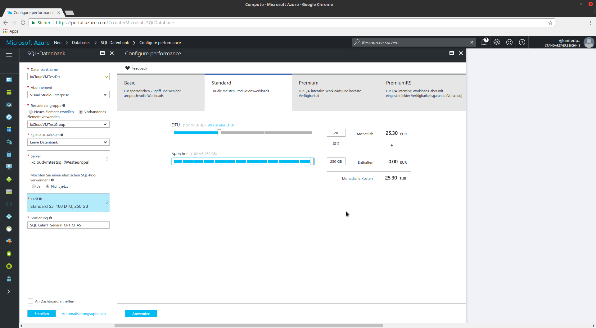

## Windows Appservers Vorbereiten

### Connect via RDP to the Windows Instance

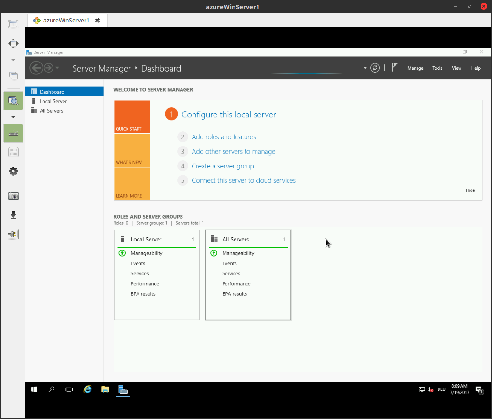

#### Laden Sie die folgende Datei herunter

`https://github.com/ansible/ansible/blob/devel/examples/scripts/ConfigureRemotingForAnsible.ps1`

#### Führen Sie diesen Befehl aus

```Bash
powershell.exe -File ConfigureRemotingForAnsible.ps1 -CertValidityDays 100
 ```

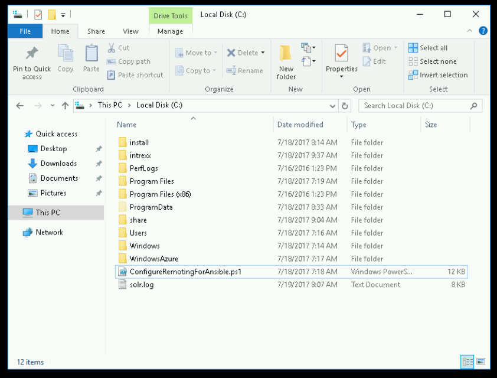
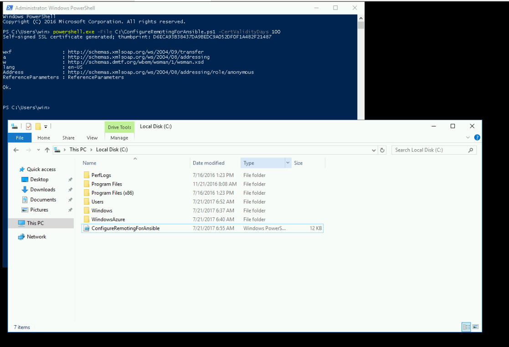

#### Downloaden und installieren Sie 7zip

Tipp: Deaktivieren sie die  Internet Explorer Enhanced Security Configuration für den Administrator Account herunter.
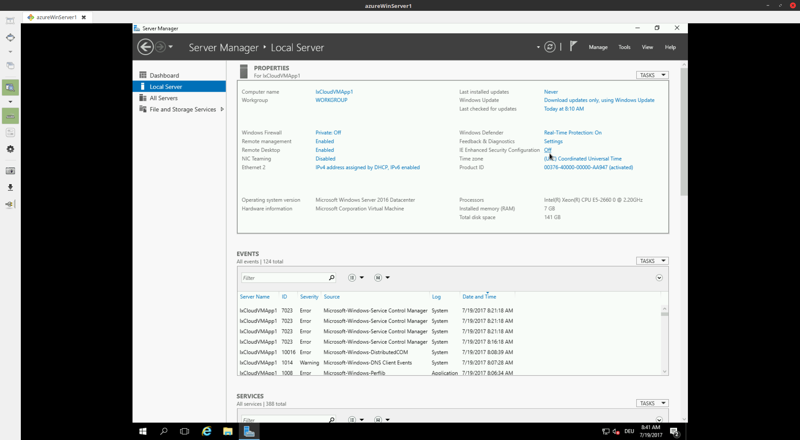
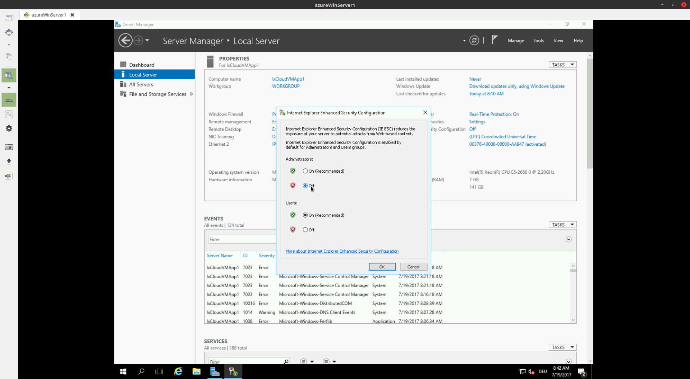

**Download 7zip**
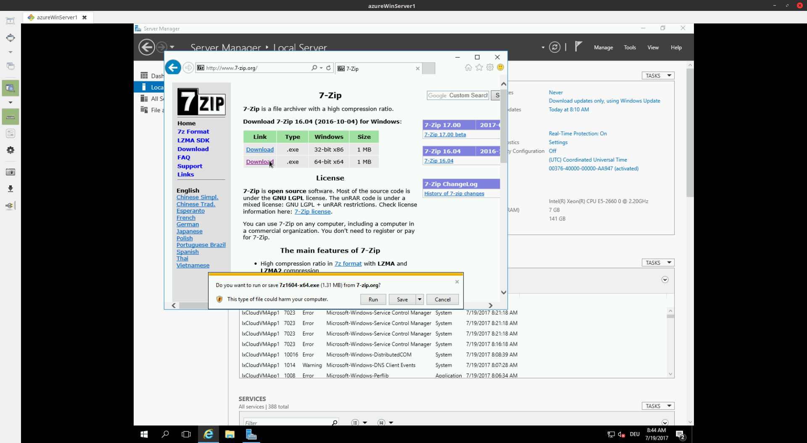

**Installieren Sie 7Zip**\
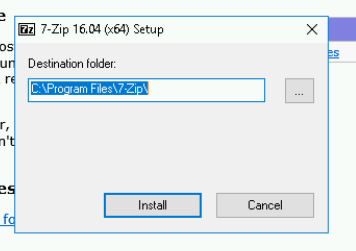

## Ansible Skripte auf der Provisioning Maschine ausführen

1. Entzippen von cloud-playbooks.zip

```bash
unzip cloud-playbooks.zip
```

2. Verschieben von professional.zip nach cloud-playbooks/files

```bash
mv professional.zip cloud-playbooks/files/
```

3. Kopieren von 7z1700-x64.msi nach cloud-playbooks/files

```bash
mv 7z1700-x64.msi cloud-playbooks/files/
```

4. Einstellungen in vars.yml anpassen

5. UNC Pfade in win_appserver_services & win_appserver_portal anpassen.

6. Ansible scripts ausführen

```bash
ansible-playbook -v -i hosts win_appserver_services.yml
ansible-playbook -v -i hosts win_appserver_portal.yml
```

## Load Balancer einrichten

Option 1: Azure Load Balancer
Option 2: Microsoft IIS mit ARR Reverse Proxy Modul auf eigener Instanz
Option 3: Nginx Reverse Proxy auf eigener Instanz

## Test

Nach Installation des Load Balancers sollte das Portal unter der öffentlichen IP Adresse des Load Balancers erreichbar sein.

## Troubleshooting

### Ansible funktioniert nicht

Bevor Ansible ausgeführt wird, muss der nachfolgende Befehl eingegeben werden:

```bash
source ./hacking/env-setup
```

Wenn Sie für jede Session die Einstellung erhalten möchten, tragen Sie den Befehl in die bash.rc ein (mit absoluten Pfaden).
