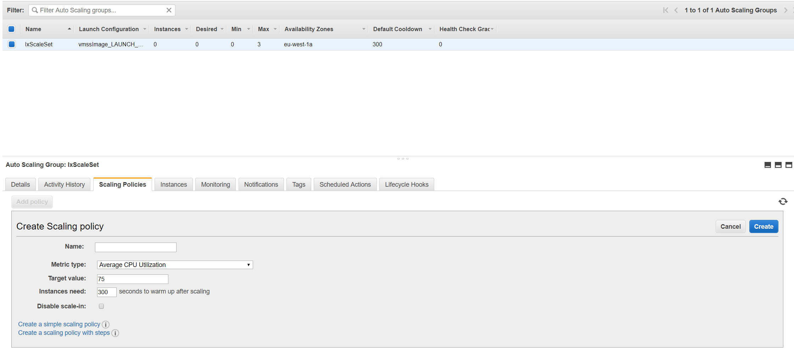

# Intrexx Cloud Installation Guide for Amazon Web Services and Microsoft Azure (Virtual Machines)

## Topics

1. [Infrastructure provisioning](#1)
2. [Intrexx cluster installation](#2)
3. [Enabling auto scaling](#3)
4. [Intrexx cluster operation](#4)
5. [Description of Ansible playbooks and resources](#5)

## Infrastructure provisioning

### Introduction

United Planet provides CLI scripts to setup an Intrexx cluster on Amazon AWS or Microsoft Azure. The scripts can be executed on a local Linux machine (or Windows 10 with Linux subsystem service enabled) and provisions the required cloud infrastructure. When the infrastructure is available, Intrexx can be installed with the provided Ansible playbooks. These will be executed on a dedicated Linux provisioning VM created by the script.

### Requirements

- Linux machine with Azure CLI or AWS CLI installed or a Windows 10 machine with Linux subsystem enabled and Azure/AWS CLI installed on the Linux subsystem.
- A local copy of the Intrexx Cloud GitHub repository.

#### Azure CLI

Install Azure CLI for Linux as desribed here: (https://docs.microsoft.com/en-us/cli/azure/install-azure-cli?view=azure-cli-latest)

Then login to your Azure account with `az login`.

#### Amazon Web Services CLI

Install AWS CLI for Linux as desribed here: https://docs.aws.amazon.com/cli/latest/userguide/install-linux.html

Then configure your AWS account:

```bash
$ aws configure
AWS Access Key ID [None]: ...
AWS Secret Access Key [None]: ...
Default region name [None]: ...
Default output format [None]: json
```

#### Prepare Intrexx Cloud Git repository

After the CLI tools for your cloud provider are installed, you need to clone this repository on your machine. It is important to keep the directory structure of the repository because the scripts rely on it.

```bash
git clone https://github.com/UnitedPlanet/intrexx-cloud-playbooks.git
cd intrexx-cloud-playbooks/cloud-provider/installer/script/
```

### Cluster architecture

The cluster architecture is independent of the chosen cloud provider. An Intrexx cluster consists of several static VM instances for specific services and an autoscale group behind a load balancer, serving Intrexx to the public internet. You can edit the installer scripts to extend the infrastructure for your needs.

#### Default cloud infrastructure components

1. IxProvisioning VM:
      The provisioning instance is used for running the Ansible playbooks to install the Intrexx cluster on the infrastructure. It can be stopped after installation but should not be terminated as it will be used for managing tasks and installing updates on the cluster.
2. IxServices VM:
      The service instance runs the SOLR search server, the filesystem server (NFS for Linux, SMB for Windows, if not using AWS EFS) for the portal server instances to access the shared portal folder and provides the portal manager REST interface, which can be accessed from outside the internal virtual private cloud. This instance must be reachable by all portal server instances.
3. IxAppServer VM:
      The app server instance is the template for the portal server VM image used in the autoscale group. At the end of the installation, it will be stopped and can be terminated and removed when the VM image and scale set has been created.
4. Database server:
      The installer creates a Postgresql or MS SQL Server database as a service instance for the portal database. During Intrexx setup, the portal setup routine will create and populate the Intrexx database.
5. Automatic horizontal scaling:
      The autoscale portal server instances will be created by the cloud provider automatically based on the rules in the autoscale set. They serve the Intrexx portal client requests.
6. Load balancer:
      A load balancer is required as single entry point for external clients and to distribute client requests across the portal server instances in the autoscale group. The installer will create a Azure or AWS load balancer service.

#### Supported databases

The following databases are supported by the installer. If you want to use another one, you have to extend the scripts accordingly.

##### AWS

* AWS RDS Postgresql database

An AWS RDS database service will be provisioned automatically by the installer.

##### Azure

* Microsoft SQLServer 

An Azure SQLServer database service will be provisioned automatically by the installer.

* Postgresql Server

An Azure Postgresql database service can be provisioned by the installer.

#### Shared file system

##### AWS EFS

An AWS EFS service will be provisioned automatically by the installer.

##### Azure NFS

For Azure setups a local NFS (Linux) or SMB (Windows) server will be installed on the IxServices instance. You are responsible managing backups and failover replications of the file system.

#### Load balancer

* Application load balancer

The load balancer distributes load across the instances in an autoscale group, which is responsible for providing enough instances and start/stopping instances when neccessary. Those instances are based on the IxAppServer VM image.

### Infrastructure provisioning scripts

The tasks of the scripts in the script folder are:

- `variables.sh`

  First of all you want to edit the general settings in this file to match your infrastructure requirements. Most options can be left as default.

- `createInfrastructure.sh`

  This script creates the general cloud infrastructure (network, vm instances...). When finished, you should be able to connect to the provisioning VM  (check console output at the end of the script execution). On this instance are all files required to install Intrexx. So when the instance is available, you will connect to it via SSH and start the Ansible playbooks to install the Intrexx services.

- `createScaleSet.sh`

  After Intrexx has been installed successfully and the IxAppServer VM was generalized (in case of Azure this needs to be done manually), this script will create the app server VM base image snapshot for the portal server scaling instances, an autoscaling group and a load balancer.

- `deleteAll.sh`

  This script deletes all created cloud resources. You can use it to clean up and start a new installation. Unfortunately, it is not always possible for the script to clean up the resource group completely in case of AWS. So check with the AWS console whether all resources have been deleted properly.

- `deleteAppServerVM.sh`

  After creating the base image from the IxAppServer VM, this instance and its dependencies become obsolete and can be deleted with this script.

### Infrastructure configuration

Before starting the installation, you have to define your preferred cloud infrastructure settings. You can achieve this by editing the parameters in file `variables.sh`. But be careful when overriding network/subnetwork IP range settings. You have to check that the private IP addresses of the app server intances are in the same range as defined in *VIRTUAL_SUBNETWORK_EXTERNAL_ONE_PREFIXES*. Otherwise, you have to adapt the IP addresses in the Ansible host files before starting the Ansible playbooks.

Generally, the parameters in `variables.sh` are divided in basic and advanced sections. Usually, it should be necessary to edit the settings in the basic section:

1. CLOUD_PROVIDER
  The cloud provider (*aws* or *azure* for now).
2. OPERATING_SYSTEM
  The instance OS (*linux* or *win*).
3. PORTAL_NAME
  Name of the portal to be created.
4. [AWS|AZ]_INSTANCE_TYPE_*
  Flavor of the instances.
7. [AWS|AZ]_OS_TYPE_*
  Operating system for the instances.
  Note: For Windows setups the chosen OS language should be English. Otherwise, the Ansible scripts must be adapted (check the Windows group name when creating the Windows services).
8. [AWS|AZ]_ADMIN_PW_WIN
  The Windows administrator user password.
9. [AWS|AZ]_DATABASE_DRIVER
  The database JDBC driver type. Currently `postgres` (AWS/Azure) or `mssql` (Azure).
10. AZ_DATABASE_TYPE
  The database type. Currently `postgres` (AWS/Azure) or `sql` (Azure SQLServer).
11. [AWS|AZ]_DISK_SIZE_[WIN|LINUX]
  The size of the additional data disk for the IxServices instance. This disk will store all the portal's data files as well as the SORL search index. Ensure to enable periodic backups/snapshots for this disk.

### Create the infrastructure

After having defined all settings in the `variables.sh` and when you are logged in to your cloud provider, you can start creating the infrastructure by executing 

```bash
./createInfrastructure.sh
```

on the command line.

The script executes the following steps, which differ only in some aspects between Azure and AWS:

1. Creates RSA keys for SSH connections between your local computer and the created instances.
2. Creates the VPC (Virtual Private Cloud). This includes several subnets the runtime services.
3. Creates SGs (Security Groups) to defince firewall rules between the subnets and the internet. During installation all instances get a public IP to allow direct connections for configuration tasks. Afterwards all these public access will be removed and only the load balancer, the IxServices (for portal manager) and the provisiong VM can be reached from outside the VPC.
4. Creates the database as well as VMs for IxServices and IxAppServer.
5. If AWS: Creates the AWS Elastic File System mountpoints.
6. Copies the Ansible playbook and installation files to the provisioning VM.
7. Restarts all created instances.
8. Prepares installation of Intrexx via the provisioning instance.

If something goes wrong during the script execution, you can always restart the script and it will continue after the last successfully executed step.
    
## Intrexx cluster installation

When the infrastructure scripts finished successfully, it prints the ssh command to connect to the provisioning VM on the console. Use that to connect to the VM and start the Intrexx installation. Intrexx and its services (shared file system and SOLR on the IxServices instance as well as the portal server on the IxAppServer instance) need to be installed by starting Ansible playbooks on the provisioning VM.

Follow these steps to install Intrexx and create a new portal:

1. First of all, check the configuration files dbVars.yml, hosts_azure/aws.yml and vars.yml (see below for a description of the settings) that all settings are correct.
2. If you want to import an existing portal, you can do so by uploading your portal export to the provisioning VM and then editing the `files/portal_config.j2` file to point the template path property to your portal export folder.
3. If you are using Linux as Intrexx OS and do not use AWS EFS as filesystem, install the file server instance: 
  ```bash
  ansible-playbook -v -i hosts_azure/aws fileserver.yml
  ```
4. Install Intrexx on the services instance (Solr, SMB fileserver for Windows):
  ```bash
  ansible-playbook -v -i hosts_azure/aws appserver_services.yml
  ```
5. Install the portal server instance:
  ```bash
  ansible-playbook -v -i hosts_azure/aws appserver_portal.yml
  ```
If something goes wrong during the playbook execution, you can always restart the playbook and it will continue after the last successfully executed step.

After all steps have been executed successfully, you can exit the provisioning VM and go back to your local script folder. Now connect to the IxAppServer instance with SSH or RDP and check that Intrexx is up and running by opening the URL `http://localhost:1337/` in the browser or via `curl http://localhost:1337/`. You should see the Intrexx start page html content in the output.

## Enabling auto scaling

*Important note:* When using Windows Server as OS for your cluster instances on Azure, you have to generalize the IxAppServer VM before calling this script. You can do that by connecting to the IxAppServer instance with RDP (get the public IP from the Azure portal) and follow the guide here:(https://docs.microsoft.com/de-de/azure/virtual-machines/windows/capture-image-resource). Before starting the generalization, check that the local Windows firewall is disabled for all profiles. Otherwise the load balancer cannot reach the portal server instances and you have to create a new IxAppServer instance and image.

To create the auto scale set and load balancer, execute 

```bash
./createScaleSet.sh
```

on your local command line.

### Execution steps

The script executes the following steps, which differ only in some aspects between Azure and AWS:

1. Creates a snapshot and image of the IxAppServer VM as master for the scale set instances.
2. Creates the autoscale set/group. This will create and remove portal server instances automatically based on rules defined in the scaling configuration. These rules must be defined manually. At the beginning the script creates a rule to start one instance.
3. Creates the load balancer and connects it with the scale set.

### Finishing steps

After the script finished all steps without error, you should be able to access the portal in the browser with the public IP address of the load balancer. You can now delete the obsolete IxAppServer instance and its public IP address.

```bash
./deleteGeneralizedVM.sh
```

### Auto scale set settings

If you want your auto scale set to react dynamically on the CPU consumption in your cluster, you have to define a policy. Use the CLI or the web console of your cloud provider to define rules and policies. Here is an example for AWS:



### *Important: Enable TLS/SSL for the load balancer*

Unfortunately, the provisioning scripts cannot generate and install a TLS/SSL certificate for the load balancer automatically. *It is highly recommended to provide a server certificate and enable TLS encryption on the load balancer.* Otherwise the connection between the portal user's browser and the load balancer is not secure and user credentials as well as other data will be transmitted unencrypted.

Please refer to the load balancer documentation of your cloud provider for instructions to enable and enforce TLS on the load balancer.

## Intrexx cluster operation

### Troubleshooting

#### Instances not reachable by load balancer

If the load balancer cannot forward requests to the portal server instances, you should check the instance count and state in the autoscaling group. Then try to connect to one of the instances via SSH or RDP and see if the portal server service is running. If that is the case, check the firewall settings in the network security group of the VPC.

#### Instances cannot form or connect to a cluster

The Intrexx portal server instances must be able to connect to each other in the IP port range 47500 - 47600 in order to detect cluster members and exchange data. Check the `datagrid.log` file in the portal logs folder (Linux `/var/log/intrexx`, Windows `C:\intrexx\log\portal`) of your instances for errors. Check that the security group's firewall rules are configured accordingly if your instances are in different subnets. When on Windows, check that the local Windows firewall is disabled or allows traffic for these port ranges.

#### Portal server instance cannot mount shared portal folder

Most of the time this is due to firewall rules. Check the security groups. When deploying on Windows, the SMB share must be accessible by group "Everyone" after the installation if no domain controller is used. You can try to restrict access to the share after your cluster started properly.

### Locating and collecting log files

Logs are stored in a location depending on the chosen operating system.

- Linux: `/var/log/intrexx`
- Windows: `C:\intrexx\log\portal`
  
You can use tools like Filebeat to collect the logs from all running instances and store them on a central location (like AWS S3 or Azure Blobs).

Refer to the Filebeat docs in this repo for further information.

### Backups

You must at least take care of automatic backups for the IxServices instance and its data disks, especially if you deploy your own file server for the shared portal folder. For all services, it is recommended to use the backup features of the cloud provider. The portal server instances should be stateless and store only log files locally.

### Online update rollout

Here are two examples of how Intrexx online updates can be installed on a running Intrexx cluster. The process might differ on your environment. Therefore, it is highly recommended to test this first on a test cluster.

#### Azure Scale Set with Windows VM instances:

- Create backups/snapshots of the Intrexx database server and the IxServices instance and its attached data disks.
- Create new Intrexx server VM instance based on current scale set image (e.g. IxVmssImage).
- Login to the new VM via RDP.
- Start Supervisor service and portal manager.
- Terminate all running scale set instances and disable automatic scaling.
- Start the online update with the portal manager.
- Run sysprep.exe and prepare VM for image capturing: https://docs.microsoft.com/en-us/azure/virtual-machines/windows/capture-image-resource
- Capture the image and define it as the new scale set image: https://docs.microsoft.com/en-us/azure/virtual-machine-scale-sets/virtual-machine-scale-sets-upgrade-scale-set#how-to-update-global-scale-set-properties

```bash
az vmss show --resource-group IxResourceGroup --name IxScaleSet
az image show --resource-group IxResourceGroup --name IxAppServer-image-20180723 (get resource path of new image)
az vmss update --resource-group IxResourceGroup --name IxScaleSet --set virtualMachineProfile.storageProfile.imageReference.id=/subscriptions/dac0529a-cd62-466d-aeda-338da0a5827f/resourceGroups/IxResourceGroup/providers/Microsoft.Compute/images/IxAppServer-image-20180723 #(updates image in scale set)
```

```bash
az vmss update-instances --resource-group IxResourceGroup --name IxScaleSet --instance-ids *
```
https://docs.microsoft.com/de-de/azure/virtual-machine-scale-sets/virtual-machine-scale-sets-upgrade-scale-set#vm-specific-updates

- Restart autoscaling and spin up new instances.
- Delete the online update VM instance and its depencencies.
- Repeat from beginning when the next OU comes out.

#### AWS Autoscaling group with Linux VM instances:

- Create backups/snapshots of the Intrexx database server and the IxServices instance and its attached data disks.
- Create new Intrexx Appserver VM based on current scale set image (e.g. IxVmssImage).
- Login to the new VM via SSH.
- Start Supervisor service.
- Check if OU contains patches requiring a single running instance during OU installation (e.g. Ignite update, locked files by other app servers...). If so, terminate all running portal server scaling group instances and disable automatic scaling.
- Start the online update:

```bash
cd /opt/intrexx/bin/linux
sudo ./upddownload.sh
sudo ./updinstall.sh
```

- Capture a snapshot of the VM image via the AWS console and define it as the new base image for your autoscaling group.
- Delete the online update VM instance and its depencencies.
- Repeat from beginning when the next OU comes out.

## Description of Ansible playbooks and resources

### Ansible playbooks

* dbVars.yml => Provides custom variables for the infrastructure provisioning.
* vars.yml => Default variables for the infrastructure provisioning.
* hosts => Defines the IP address of all hosts in the cluster.
* files => Contains files required for Intrexx installation.
* appserver_services.yml => Playbook creates IxServices instance (NFS, SMB, SOLR).
* appserver_portal.yml => Playbook creates the IxAppServer instance (portal server).
* appserver_restart.yml => Restarts all app server instances.
* dbserver.yml => Playbook creates a Postgresql database instance (only required for non database as a service setups).
* fileserver.yml => Playbook creates a NFS file server instance on the IxServices instance.
* loadbalancer.yml => Playbook creates a Nginx reverse proxy (only required for non load balancer as a service setups).

### hosts_azure/host_aws

Defines on which instances which services will be installed:

```bash
[fileserver]
10.0.0.5 hostname=IxServices ipaddr=10.0.0.5

[loadbalancer]
10.0.0.5 hostname=IxServices ipaddr=10.0.0.5

[appserver_services]
10.0.0.5 hostname=IxServices ipaddr=10.0.0.5

[appserver_portal]
10.0.0.6 hostname=IxAppServer ipaddr=10.0.0.6
```
