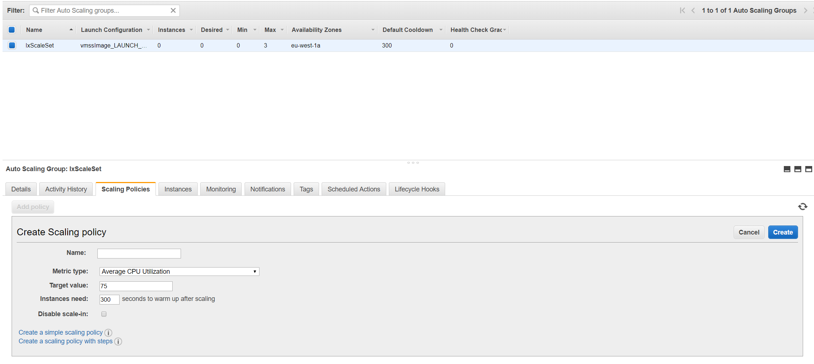

# Intrexx Cloud Installation für Amazon Web Services und Microsoft Azure (Virtual Machines)

## Inhalt

1. [Automatisierte Cloud-Erzeugung](#1)
2. [Beschreibung der Playbooks und Ansible-Konfigurationsdateien](#2)

## Automatisierte Cloud-Erzeugung

### Ziel

Das Ziel der Skripte ist die automatisierte Erzeugung von Cloud-Instanzen für die Vereinfachung der Installation von Intrexx in der Amazon-Cloud AWS bzw. Microsoft-Cloud Azure. Dabei werden mehrere Instanzen aufgesetzt, so dass der Service von Intrexx auf mehrere Instanzen aufgeteilt werden kann, aber trotz dessen durch nur einen URL angesprochen werden kann. Dies wird durch die Verwendung eines Load Balancers und dem Verweis auf eine Autoscale-Group umgesetzt.

### Konzept

Das generelle Konzept ist unabhängig von dem verwendeten Cloud-Anbieter. Es gibt mehrere statische Instanzen mit spezifischen Aufgaben und zusätzlich die Autoscale-Group, welche durch einen Load Balancer, Intrexx an das Internet anbindet.

#### EC2 Instanzen

1. IxServices
       Die Service-Instanz beinhaltet den SOLR Server, das geteilte Dateisystem (sofern nicht AWS EFS eingesetzt wird) und bietet die SOAP-Schnittstelle, welche auch außerhalb des internen Netzes von AWS erreichbar ist. Diese Instanz muss von allen Portalservern erreichbar sein.
2. IxAppServer
       Die Appserver-Instanz wird automatisiert komplett eingerichtet und daraufhin als Image für die Instanzen der Autoscale-Group verwendet. Diese Instanz wird am Ende des Skripts automatisch gestoppt und kann dann entfernt werden (terminiert im Kontext von AWS).
3. IxProvisioning
       Die Provisioning-Instanz dient als Schnittstelle, um Zugriff auf die internen Instanzen zu erhalten. Über diese Instanz wird die Installation von Intrexx organisiert. Nach der Installation kann diese Instanz gestoppt werden. Allerdings sollte diese nicht terminiert werden, um beispielsweise Updates auf die internen Instanzen aufzuspielen.
4. Autoscale-Group
       Die Autoscale-Instanzen werden automatisiert erzeugt und terminiert. Diese sind für die eigentliche Kommunikation mit den Clienten zuständig, wobei diese über einen Load-Balancer erreichbar sind und damit über eine URL.

#### Datenbank

##### AWS RDS

* Postgres Datenbank

Die Datenbank wird durch eine RDS Instanz realisiert, wodurch die Installation und Einrichtung von Postgres durch AWS automatisiert statt findet.

##### Azure SQL Server

* Microsoft SQL Datenbank

  Die Datenbank wird durch eine Datenbank-Instanz realisiert, welche keinerlei weitere Einrichtung erfordert. Diese stellt eine MS SQL Datenbank zur Verfügung.

#### NFS Dateisystem

##### AWS EFS

Bei AWS Installationen wird automatisch eine AWS EFS Instanz erstellt.

##### Azure NFS

Bei Azure Installationen wird ein lokaler NFS (Linux)- oder SMB (Windows)-Server auf der IxServices Instanz eingereichtet. Für die Sicherung und Replizierung ist der Betreiber verantwortlich.

#### Load-Balancer

* Application-Load-Balancer

  Der Load-Balancer von verteilt die Last der Anfragen auf eine Autoscale-Group, welche eine definierte Anzahl an Instanzen bereit hält und darüber hinaus temporär weitere hinzufügen kann. Diese Instanzen werden aus einem Snapshot des Appservers erzeugt.

### Konfiguration der Installation

In der Datei *`variables.sh`* können einige Parameter im Bezug auf AWS, Azure und Intrexx vor der Installation angepasst werden. Essenzielle Einstellungen von AWS und Azure können in dieser Datei angepasst werden, beispielsweise die Typen der Instanzen.

Jedoch sollten bestehende Abhängigkeiten nicht verletzt werden, beispielsweise müssen die privaten IPs der Instanzen in dem IP-Bereich liegen, welcher bei *VIRTUAL_SUBNETWORK_EXTERNAL_ONE_PREFIXES* angegeben ist. Außerdem müssen ebenfalls die IPs in den Ansible-Skripten für die Installation angepasst werden.

Generell sind die Variablen in *`variables.sh`* unterteilt in basic und advanced. Im Grunde müssen für die generelle Installation nur die Variablen in dem oberen Teil angepasst werden.

1. CLOUD_PROVIDER
  Der jeweilige cloud provider (zulässig sind *aws* oder *azure*).
2. OPERATING_SYSTEM
  Das Betriebssystem der Instanzen, auf denen Intrexx installiert wird (zulässig sind *win* oder *linux*).
3. PORTAL_NAME
  Name des Portals, das installiert wird, dies ist insbesondere wichtig für die Health Pings des Load Balancers.
4. DATA_DIR
  Verzeichnis, in dem das Intrexx-Installationspaket gespeichert ist.
5. INTREXX_SETUP_LINUX
* Dateiname der Linux Intrexx-Installationspaket-Zipdatei.
* Intrexx Download: `wget https://download.unitedplanet.com/intrexx/90200/intrexx-19.03.0-linux-x86_64.tar.gz`
6. INTREXX_SETUP_WINDOWS
* Dateiname der Windows Intrexx-Installationspaket-Zipdatei.
* Intrexx Download: `wget https://download.unitedplanet.com/intrexx/90200/intrexx-19.03.0-windows-x86_64.zip`


Zusätzlich interessante Variablen:

1. [AWS|AZ]_INSTANCE_TYPE_*
  Hier werden die typen der Instanzen festgelegt, also die Leistungskonfiguration der Instanzen.
2. [AWS|AZ]_OS_TYPE_*
  Hier wird das zu verwendende Betriebssystem angegeben.
  Note: Zu beachten insbesondere bei Windows ist die verwendete Sprache (default englisch). Bei einer anderen Sprache müssen die Ansible Scripte teilweise angepasst werden. Beim erstellen der Services müssen die Benutzer von *EVERYONE* zu dem gleichwertigen in der jeweiligen Sprache verändert werden (z.B. für deutsch: *JEDER*)
3. [AWS|AZ]_ADMIN_PW_WIN
  Hier kann das Windows Passwort angegeben werden.
4. [AWS|AZ]_DATABASE_DRIVER
  Der Datenbanktyp: `postgres` (AWS/Azure) oder `mssql` (Azure).

### Beschreibung der Skript-Struktur

Die Basisscripte sind im Hauptordner zu finden, die Aufgaben dieser sind wie folgt:

1. *`createInfrastructure.sh`*

  Dieses Script kann verwendet werden um die generelle Infrastructur sowie alle Instanzen zu erzeugen. Nach Vollendung dieses Scripts, kann man sich auf die Provisioning VM einloggen (siehe Consolenausgabe am Ende des Scriptdurchlaufs). Auf dieser befinden sich alle Dateien, welche für die Installation von Intrexx via Ansible nötig sind.
1. *`createScaleSet.sh`*

  Nachdem Intrexx erfolgreich auf der IxAppServer Instanz installiert wurde, kann dieses Script verwendet werden um die Autoscale-Group sowie den Load Balancer zu erzeugen. Dabei wird automatische in Image bzw. Snapshot des Appservers erzeugt und für die Skalierung verwendet.
1. *`deleteAll.sh`*

  Dieses Script kann verwendet werden um alle erzeugten Resourcen zu entfernen. Insbesondere bei Azure funktioniert dies zuverlässig durch die Verwendung einer ResourceGroup. Im Fall von AWS wird rekursiv versucht alle Resourcen mit einem bestimmten Tag zu löschen. Leider lassen sich nicht alle Resourcen taggen, so dass dies nicht zuverlässig funktioniert. Über die Oberfläche lässt sich jedoch alles über einen Klick entfernen.
1. *`deleteAppServerVM.sh`*

  Dieses Script löscht die Appserver-Instanz, welche nach dem Erzeugen eines Images bzw. Snapshots nicht mehr benötigt wird. Da die Instanz für diesen Prozess runtergefahren und nicht erneut gestartet wird, ist dies nicht unbedingt nötig, jedoch können abhängig von dem Verwendeten Cloud-Provider Gebühren für die noch vorhandenen Volumes der Instanz anfallen.
1. *`variables.sh`*

  In diesem Script befinden sich die Parameter, welche Anpassungen der Cloud-Infrastruktur ermöglichen.

### Start der Installation *`createInfrastructure.sh`*

Das Skript wird gestartet in dem die Datei *`createInfrastructure.sh`* mit dem Befehl *`bash createInfrastructure.sh`* in der Konsole ausgeführt wird.

```bash
git clone https://github.com/UnitedPlanet/intrexx-cloud-playbooks.git
cd intrexx-cloud-playbooks/cloud-provider/installer/script/
bash createInfrastructure.sh
```

### Ablauf des Skripts

Der Ablauf der Skripte unterscheidet sich nur unwesentlich bei AWS und Azure. Bei Azure fällt lediglich Punkt 3 der folgenden Beschreibung weg, der weitere grundsätzliche Ablauf ist dabei identisch.

1. Erzeugung der RSA-Keys für die Kommunikation mit den Instanzen und zwischen den Instanzen via SSH.
2. Erzeugung des VPC (Virtual Private Cloud).
   Dieses enthält mehrere Subnetze, insbesondere die Datenbank und der Load-Balancer benötigen jeweils zwei Subnetze in verschiedenen AZs (Availability Zone) aus Gründen der Redundanz. Die Subnetze werden mit Root-Tables versehen und das VPC mit einer Anbindung an das Internet.
3. Erzeugung der SGs (Security Groups), durch welche die Kommunikation sowohl zwischen verschiedenen Instanzen als auch mit dem Internet ermöglicht wird.
   Es werden mehrere SGs erzeugt, um die verschiedenen Instanzen abzusichern. Während der Installation ist es erlaubt mit den verschiedenen Instanzen via SSH zu kommunizieren, jedoch wird dies zuletzt entfernt, so dass nur noch die Provisioning-Instanz über Port 22 ansprechbar ist. Die IxServices-Instanz ist weiterhin über das Internet via SOAP (Port 8101) ansprechbar. Der Load-Balancer ist konfigurierbar und standardmäßig über Port 8080 und 8443 ansprechbar. Alle weiteren Instanzen sind nicht oder zumindest nicht direkt über das Internet erreichbar, so erhalten die Instanzen der Autoscale-Group die Anfragen über den Load-Balancer.
4. Erzeugung der Datenbank und der statischen Instanzen (Services- und Portalserver-Instanz).
5. Falls AWS: Erzeugung des AWS Elastic File System Mountpoints.
6. Kopieren der Installationsdateien.
   Die Ansible-Dateien sowie die ZIP mit der Intrexx-Installation wird auf die Provisioning-Instanz kopiert.
7. Neustart aller Instanzen.
8. Installation von Intrexx über die Provisioning-Instanz.
   Die Installation von Intrexx (Dateisystem und SOLR auf der IxServices-Instanz, sowie Intrexx auf der IxAppServer-Instanz) muss manuell gestartet werden, da vereinzelt Benutzereingaben nötig sein können.

* Anpassen der hosts.yml und vars.yml Dateien.
* Installation Fileserver (nur Azure) -> `ansible-playbook -v -i hosts_azure fileserver.yml`
* Installation services (Solr, NFS) node -> `ansible-playbook -v -i hosts_azure appserver_services.yml`
* Installation portal server -> `ansible-playbook -v -i hosts_azure appserver_portal.yml`

### Erzeugung der Autoscalegruppe

Das Skript wird gestartet in dem die Datei *`createScaleSet.sh`* mit dem Befehl *`bash createScaleSet.sh`* in der Konsole ausgeführt wird.

*NOTE:* Im Falle von Azure und dem Betriebssystem Windows, muss die Appserver-Instanz vor dem Ausführen des Scripts generalisiert werden. Dies muss per Remote Desktop Verbindung zu der Appserver-Instanz gemäß der Anleitung unter [](https://docs.microsoft.com/de-de/azure/virtual-machines/windows/capture-image-resource) durchgeführt werden. Dabei ist zu beachten, dass die Appserver-Instanz daraufhin unbrauchbar wird und gelöscht werden kann (lediglich von dieser Instanz erzeugte Images sind benutzbar).

### Ablauf des Skripts *`createScaleSet.sh`*

1. Image/Snapshot der Appserver-Instanz erstellen.
1. Autoscalegruppe erzeugen

  Diese ermöglicht das Automatisierte hinzufügen bzw. löschen von Instanzen in Abhängigkeit von definierten Regeln (muss manuell hinzugefügt werden). Dabei werden Instanzen basierend auf dem vorher Erzeugten Image/Snapshot einer eingerichteten Appserver-Instanz erstellt und gestartet.
3. Erzeugung des Load Balancers

  Dieser erhält Regeln für die Weiterleitung von Anfragen aus dem Internet an die entsprechenden Instanzen der Autoscalegruppe.

### Wichtige Anpassungen nach der Installation

Die Autoscale-Group fährt automatisiert die konfigurierte Anzahl an Instanzen hoch, allerdings muss für die automatisierte Reaktion auf z.B. erhöhte CPU-Auslastung eine *`policy`* hinzugefügt werden. Dies kann sowohl über die Cli erfolgen als auch direkt durch die Weboberfläche (z.B. bei AWS: siehe Screenshot).



## Beschreibung der Playbooks und Ansible-Konfigurationsdateien

### Verzeichnissstrucktur "cloud-playbooks"

* files => In diesem Ordner liegen Dateien, die für das Intrexx Setup benötigt werden.
* appserver.yml => Startet appserver_services.yml & appserver_portal.yml Playbooks
* appserver_services.yml => Playbook erstellt den IxServices Appserver
* appserver_restart.yml => Startet die Appserver neu
* appserver_portal.yml => Playbook erstellt die Appserver
* dbserver.yml => Playbook erstellt Datenbank Server mit Postgres Datenbank
* hosts => Hier werden die Hosts definiert, ink. der IP Adressen
* loadbalancer.yml => Playbook zum erstellen  des NginX Reverse Proxy
* site.yml => Startet appserver.yml & dbserver.yml Playbooks (Gesammter Cluster wird erstellt)
* vars.yml => Hier werden die Variablen für die andern Playbooks definiert. z.B.: Postgres Zugangsdaten, NginX Settings

### appserver_services.yml

Wichtige Variablen:

* remote_user => Linux-User der Instanz

Playbook Ablauf:

1. Änderung der /etc/host
2. Installation und Anlegen der NFS-Pattion unter dem Pfad /share (Verteilte Festplatte)
3. Kopieren und Entpacken des Setups.
4. Intrexx installation
5. Portal installation auf dem /share Verzeichniss
6. Stop der Intrexx-Dienste
7. Kopieren und Ersetzten der Dateien aus ./files
8. Start der Intrexx-Dienste

### appserver_portal.yml

Wichtige Variablen:

* remote_user => Linux-User der Instanz

Playbook Ablauf:

1. Änderung der /etc/host
2. Installation des NFS Dienst und mount der NFS-Pattion unter dem Pfad /share (Verteilte Festplatte)
3. Kopieren und Entpacken des Setups.
4. Intrexx installation
5. Stop der Intrexx-Dienste
6. Kopieren und Ersetzten der Dateien aus ./files
7. Start der Intrexx-Dienste

### hosts

Definiton der Hosts/Instanzen, ink der IP-Adressen, die in den Playbooks verwendet werden.
Definiert auf welchen Instanzen die entsprechenden Playbooks abgespielt werden.

```bash
[appserver_services]
10.0.0.5 hostname=IxCloudVMTestServices ipaddr=10.0.0.5

[appserver_portal]
10.0.0.6 hostname=IxCloudVMTestApp1 ipaddr=10.0.0.6
10.0.0.7 hostname=IxCloudVMTestApp2 ipaddr=10.0.0.7
10.0.0.8 hostname=IxCloudVMTestApp3 ipaddr=10.0.0.8

[nginx]
10.0.0.5 hostname=IxCloudVMTestServices ipaddr=10.0.0.5
```

### vars.yml

Definitionen:

* Postgres
  * Version
  * Encoding
  * DB-Owner
  * IP-Adresse
  * Subnetz
  * Zugangsdaten
    * Name
    * Passwort
    * Verschlüsselt
  * User Rechte
* NFS exports
* NginX
  * name
  * Strategie
  * Server IP-Adressen
  * vHost
