# Intrexx container orchestration with Kubernetes

## Contents

1. [Abstract](#abstract)
2. [Cluster topology](#cluster-topology)
3. [Prerequisites](#prerequisites)
4. [Setting up a Kubernetes Cluster with Azure AKS](#setting-up-a-kubernetes-cluster-with-azure-aks)
5. [Container setup](#container-setup)
6. [Docker container registry](#docker-container-registry)
7. [Sharing the portal folder](#sharing-the-portal-folder)
8. [Importing the portal database](#importing-the-portal-database)
9.  [Prepare Intrexx deployment](#prepare-intrexx-deployment)
10. [Cluster deployment](#cluster-deployment)
11. [Setting up a Kubernetes Cluster with Amazon AWS EKS](#setting-up-a-kubernetes-cluster-with-amazon-aws-aks)
12. [Cluster operations](#cluster-operations)
13. [Appendix](#appendix)

## Abstract

This document describes the deployment of an Intrexx cluster on Kubernetes. Microsoft Azure Kubernetes Service (AKS) was chosen for the following example but the steps can be easily replicated on AWS EKS or Google Kubernetes Engine. Please note that it is always recommended to use the integrated Kubernetes solution of your cloud provider, if applicable. This comes with deeper integration with the cloud provider services (load balancers, elastic block devices, etc.). But it is also possible to deploy Intrexx on an on-premise Kubernetes cluster.

Warning: This setup guide is meant for demonstration purposes only. Reliability and security issues are considered only on a very basic level. Do not use it as is for production clusters!

## Cluster topology

We are going to deploy an Intrexx cluster consisting of Kubernetes nodes, pods and services:

### Nodes

- One Kubernetes master node (virtual compute instance) for managing the cluster.
- Three Kubernetes agent (worker) nodes (virtual compute instances) for running the Docker containers.

### Pods

- A deployment (replication controller) of portal server pods with 2..n replicas. Another one for a dedicated portal manager instances can be deployed on demand.

### Services

- To have cluster-wide virtual IPs and DNS names for the Postgres and Tomcat services, there is one Kubernetes service for the portal server pods and one for the portal manager node server instance.
- 
### Solr

It is highly recommended to deploy a Solr Cloud cluster for your Intrexx cluster. We will run Solr on the shared folder VM instance to keep things simple here.

### Postgresql database

- A Postgresql database as a service is deployed in Azure in order to host the portal server database.

### Network File Server

- A NFS service is installed on a separate virtual machine in order to share the portal folder with the pods.

### Load balancer

- As gateway to the public internet an external load balancer managed by your cloud provider will be deployed.

### Container registry

- In order to let Kubernetes pull latest Docker images on the nodes, a Docker registry is required. We will use the Azure Containter Registry as example.

## Prerequisites

- A Linux box with Git, Azure CLI (or AWS/GCP CLI) and latest Docker packages installed.
- An admin account with the cloud provider of your choice. This guide assumes Microsoft Azure.
- General understanding of the Kubernetes architecture and concepts is expected. Please refer to the [Kubernetes docs](https://kubernetes.io/docs/home/) for details about the concepts of nodes, pods, services, deployments, etc.

## Setting up a Kubernetes Cluster with Azure AKS

Azure AKS allows to create a defineable amount of node instances, which are managed via an API of Azure. In detail, the Azure Cli allows to receive the credentials of the Kubernetes manager node, so that Kubernetes CLI (kubectl) can be used on the same machine where the Docker images have been created to start and stop services/pods/etc. Furthermore, these managed servers are contained in an availability set, so that they are dynamically restarted in cases of unexpected server failures. An Azure load balancer can be deployed via a Kubernetes script (yaml file), which automatically links external traffic to the selected pods, which are in this case the pods running the Intrexx containers.

### Create Azure Service Credentials

To use the Container Service AKS of Azure, one needs to install the Azure CLI tools and execute

```bash
az login
...
az account set --subscription "mySubscriptionID"
...
az group create --name "myResourceGroup" --location "westus"
...
az ad sp create-for-rbac --role="Contributor" --scopes="/subscriptions/<subscriptionID>/resourceGroups/<resourceGroupName>"
```

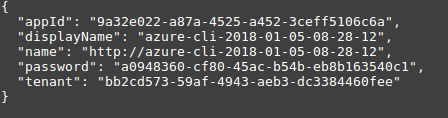

### Create AKS Service

An AKS instance can only be created into an empty resource group. The Azure Container Registry has to be in the same resource group for some reason. Therefore, 1. Create a resource group for the manager node 

```bash
az group create --name ixcluster --location westeurope 
```

2. Create the AKS node

The AKS manager node can be created as shown below.

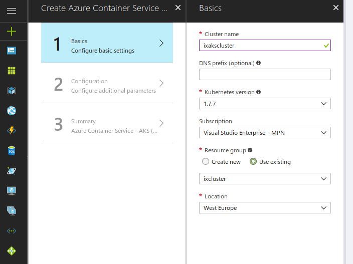

The Service principle client ID is the service id created earlier. In detail, the client ID is the appID of the output JSON when creating the service principle and the secret is the password shown in the JSON. When choosing the amount of nodes and the virtual size of the nodes, consider the amount of pods with their individual settings. For example if a single pod needs 1 up to a max of 2 CPU cores, a VM should provide at least 4 CPU cores so that more than one pod can be deployed on this VM at once.   

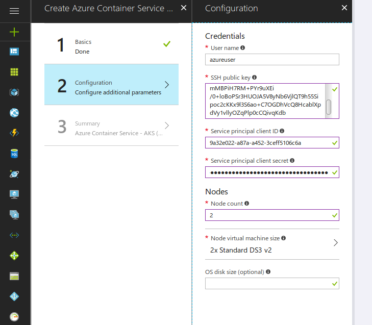

3. Create the Container Registry

Again, the docker images have to be uploaded to Azure and therefore a Container Registry is necessary.

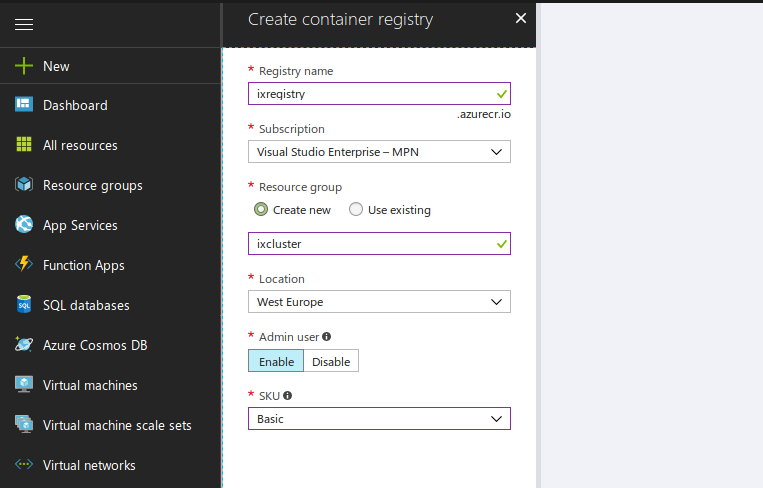

The upload is similar to the procedure earlier and therefore not described in more detail at this point.

## Container setup

First of all, the required Docker images for Intrexx must be prepared and built:

1. Clone repository `git clone https://github.com/UnitedPlanet/intrexx-cloud-playbooks` and change to folder `kubernetes/linux`.
2. Download Intrexx setup tarball via `wget https://download.unitedplanet.com/intrexx/90400/intrexx-20.03-linux-x86_64.tar.gz` and extract it into the repository root folder: `tar cvfz intrexx-20.03-linux-x86_64.tar.gz`. Then rename the `IX_20.03` folder to `intrexx`.
3. Open `setup/resources/portal_config.xml` and verify the settings.
4. Now build the Intrexx Docker images. Execute `./build_image.sh` to start the Intrexx setup process. You should see the output of the setup process in the console.
5. After the build finished successfully, you will have a new `portal` folder and `portal.tar.gz` file. This contains all files for the shared portal folder. Furthermore, three Docker images were created and stored in the local Docker registry. One for the application servers (`ixcloud`), one for Solr (`ixcloudsolr`) and one for the Postgresql database (`ixclouddb`). Check that the images are available with `docker images`.

## Docker container registry

For pulling the Docker images on our Kubernetes cluster, a public or private Docker registry is required. Usually one is created when you create the AKS cluster in Azure as above. If not, you can follow these steps to create a new registry in Azure:

1. Login to [Azure Portal](#portal.azure.com)
2. Create a new `Azure Container Registry`. Important: Enable admin user.

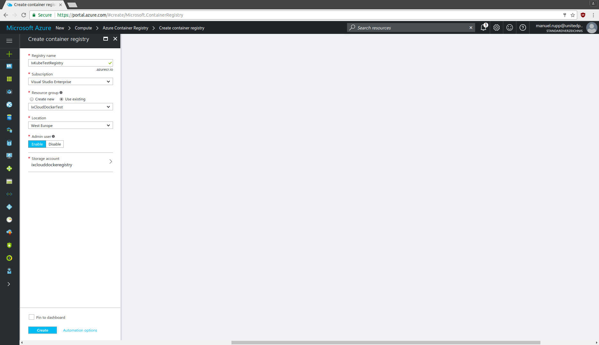

3. When registry is available, note down the admin user name and password.

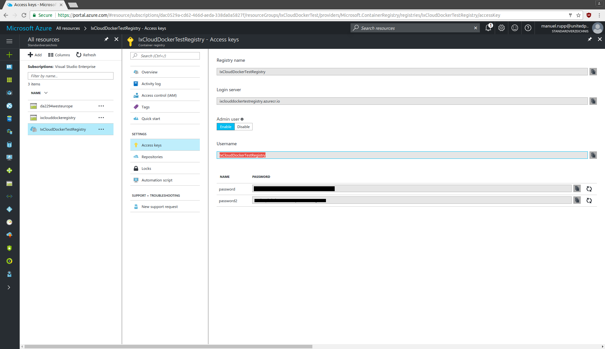

### Publish images

Now that the registry is available, the images can be tagged to the external registry location and uploaded to it:

```bash
docker login <registryname>.azurecr.io -u <registry_username> -p <registry_password>
docker tag ixcloud <registryname>.azurecr.io/ixdocker/ixcloud
```

Don't forget to adjust the registry URL and location as well as username and password in the snippet above. Upload of the images will take a while.
the deployment has to be in the correct order.

## Sharing the portal folder

In order to be available in all Intrexx pods, the portal folder must be shared between the cluster nodes. Again, to keep things simple, we will deploy a VM in the same VPC as the Kubernetes cluster with a NFS server to publish the portal folder as a network share. Kubernetes can mount the share automatically when the portal server pods are started. In a production environment the NFS server will either be deployed on a dedicated/replicated VM or a cloud provider hosted file server service (e.g.g AWS EFS) can be used. Another option would be to deploy a clustered filesystem, for example GlusterFS.

Since the servers, which provide the resources for the Kubernetes nodes, are automatically created by the AKS manager node, the share folder has to be provided in addition. Therefore, a simple linux VM with small CPU power is enough, since this VM is only used to provide the share folder. It is higly recommended to put the VM into the same VPC/subnetwork in order to be accessible by the Kubernetes agent nodes.

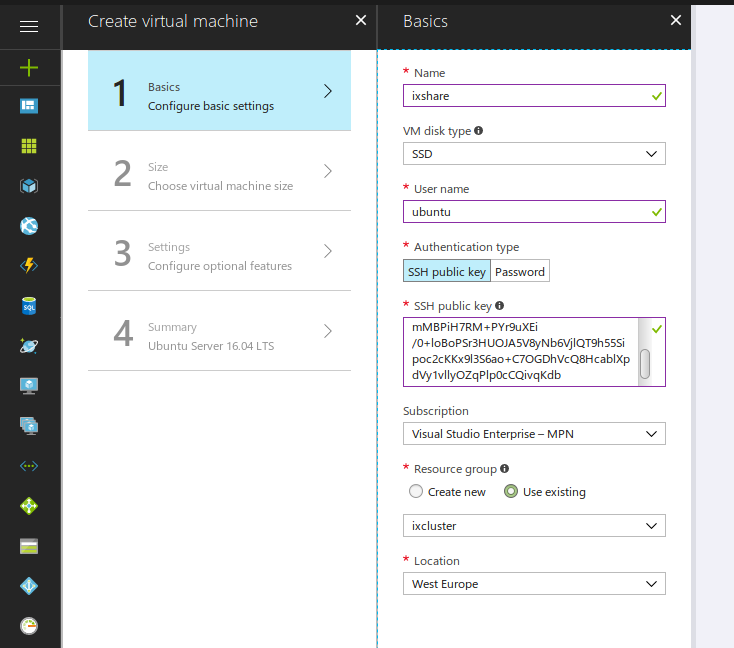

### NFS server installation

SSH into the created VM and install the NFS required packages.

```bash
sudo apt-get install nfs-kernel-server
```

### Solr Clour server installation

Install Solr Cloud on the NFS server instance.

### Creating the portal folder

Copy (scp) the previously built `portal.tar.gz` onto the VM and extract to the `/share` folder.

```bash
scp server_share.tar.gz ubuntu@40.68.162.226:~/

ssh ubuntu@40.68.162.226
sudo mkdir /share
sudo apt-get install p7zip-full nfs-kernel-server
sudo tar xvfz server_share.tar.gz
sudo mv share/* /share/
sudo chown -R nobody:nogroup /share
sudo chmod -R 777 /share
```

### Exporting the portal folder

The /share folder is ready for export via nfs. Edit `/etc/exports` and add the line:

```bash
/share *(rw,sync,fsid=0,no_root_squash,crossmnt,no_subtree_check)
```

Then restart the nfs service `sudo systemctl restart nfs-server`. The exported folder is now available for Kubernetes to mount into containers.

The /share folder is ready for export via nfs. Edit `/etc/exports` and add the line:

```bash
/share *(rw,sync,fsid=0,no_root_squash,crossmnt,no_subtree_check)
```

Then restart the nfs service `sudo systemctl restart nfs-server`. The exported folder is now available for Kubernetes to mount into containers. The following command shows all folders, which are exported by the current VM.

```bash
showmount -e
```
If everything works correctly, the output of this statement should look like this:

```bash
ubuntu@ixshare:~$ showmount -e
Export list for ixshare:
/share *
```

## Importing the portal database

These steps are only required if an Azure Postgres Database is created via "Azure Database for PostgreSQL" instead of running the database in a Kubernetes pod.

1. Transfer the database dump to the share VM.
    ```bash
    scp postgres/ixcloudapp.sql ubuntu@40.68.162.226:~/
    ```

2. Install the postgres client on the share VM and deploy the database
  ```bash
  sudo apt-get install postgresql-client-9.5
  createdb ixcloud -h ixdatabase.postgres.database.azure.com -p 5432 -U postgres@ixdatabase
  psql -h ixdatabase.postgres.database.azure.com -p 5432 -U postgres@ixdatabase -d ixcloud -f ixcloudapp.sql
  ```

3. Set the database credentials in the poolmanager.cfg in the portal folder of the share folder

  ```bash
  /opt/intrexx/org/<portalname>/internal/cfg/poolmanager.cfg
  ```
  Set the password, database name and the sever dns address in the poolmanager.cfg file.

  ```xml
  <?xml version="1.0" encoding="UTF-8"?>
  <jdbcpoolmanager>
  <database class="org.postgresql.ds.PGConnectionPoolDataSource" cleanupinterval="120" descriptorclass="de.uplanet.jdbc.postgres.PostgresDescriptor" 
  maxconnectionage="600" maxunusedtime="120" name="IxSysDb" pooling="true" readonly="false" timezone="UTC">
        <property name="password" type="string" value="--PASSWORD--"/>
        <property name="databaseName" type="string" value="--DB-NAME--"/>
        <property name="serverName" type="string" value="--SERVER-DNS--"/>
        <property name="user" type="string" value="postgres"/>
        <property name="portNumber" type="int" value="5432"/>
      </database>
  </jdbcpoolmanager>
  ```

## Prepare Intrexx deployment

### Enable the control of the Kubernetes Nodes on the local machine

The following command allows to get the credentials of the manager node of the Azure Kubernetes Cluster. After executing the following command, the Kubernetes Cli can be used to configure and manage the Kubernetes Cluster Nodes.

```bash
az aks get-credentials --resource-group "myResourceGroup" --name "myAksCluster"
```

To verify the correct execution of the previous result, the Kubernetes Nodes can be shown by the following command, which should result in a similar output as shown in the picture.

```bash
kubectl get nodes
```

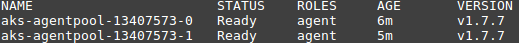

### Register container registry with Kubernetes (optional)

In order to pull container images on the agent nodes, Kubernetes must be granted access to the container registry. This happens automatically if you created AKS along with an ACR. Otherwise, it can be achieved as follows:

```bash
kubectl create secret docker-registry myregistrykey --docker-server=DOCKER_REGISTRY_SERVER --docker-username=DOCKER_USER --docker-password=DOCKER_PASSWORD --docker-email=DOCKER_EMAIL
```

```bash
kubectl create secret docker-registry ixclouddockertestregistry --docker-server=ixclouddockertestregistry.azurecr.io --docker-username=IxCloudDockerTestRegistry --docker-password=<PASSWORD> --docker-email=example@example.com
```

## Intrexx deployment

### Deploy the database pod

If the database should be deployed via a Kubernetes pod instead of a database as a service, run the following commands. The content of the files have been discussed earlier.

```bash
kubectl create -f db.yaml
kubectl create -f db-service.yaml
```

### Portal server deployment

After the database is available, we can deploy the portal server pods. Edit the appserver.yaml file and verify that the container image URI and image pull secrets as well as the nfs server IP adress match your settings.

This deployment descriptor creates two replicas of the portalserver container and mounts the nfs exported shared portal folder into the container.

```bash
$ kubectl create -f appserver.yaml
$ kubectl get pods

NAME                                 READY     STATUS              RESTARTS   AGE
ixcloud-deployment-929028525-kpcb2   0/1       ContainerCreating   0          4m
ixcloud-deployment-929028525-rtq8m   0/1       ContainerCreating   0          4m
ixclouddb                            1/1       Running             0          56m
```

To deploy the Solr and Intrexx pod, run the following commands.

```bash
kubectl create -f solr.yaml
kubectl create -f solr-service.yaml

kubectl create -f appserver.yaml
```

### Create an internal load balancer (optional)

When the portal server pods are up and running, we can deploy a Kubernetes service for our portal server pods. This service is the external entry point for the cluster and acts as a proxy and load balancer for external requests to our portal server cluster. In this case, the internal cluster port 8080 is mapped to a node port. So an external cloud load balancer can route requests to a given port on the nodes on which the Kubernetes proxy listens and redirects the request to internal cluster pods. In a real-world scenario one might use the ExternalLoadBalancer directive to let Kubernetes configure the cloud provider load balancer automatically instead of using node ports (see next chapter).

```bash
$ kubectl create -f appserver-service.yaml
$ kubectl get services -o wide
NAME               CLUSTER-IP      EXTERNAL-IP   PORT(S)          AGE       SELECTOR
ixclouddbservice   10.104.182.13   <none>        5432/TCP         6h        app=ixclouddb
ixcloudservice     10.108.122.24   <nodes>       8080:32753/TCP   5h        app=ixcloudapp
kubernetes         10.96.0.1       <none>        443/TCP          6d        <none>
```

### Create an external Azure Load Balancer (recommended)

This will automatically create an external Azure Load Balancer, however, the health probe has to be set via the CLI or the online plattform.

```bash
kubectl create -f appserver-service-azure.yaml
```

### Verifying portal server state

To test access to the portal server instances, you can create HTTP requests to each node with the node port retrieved from the `kubectl get services` command or with the external LB public IP address. For example:

```bash
curl http://10.0.0.5:32537/
...
curl http://10.0.0.6:32537/
...
```

Each request should output the Intrexx login page HTML to the console. You can now configure an [external load balancer/reverse proxy](https://kubernetes.io/docs/concepts/services-networking/service/#type-loadbalancer) to forward internet requests to the nodes. Another possibility is deploying a Kubernetes [ingress controller](https://kubernetes.io/docs/concepts/services-networking/ingress/). Both is beyond the scope of this tutorial.

### Create portal administration/manager instance and service

This deployment descriptor creates one instance of the portalserver container dedicated for portal manager administrative access.

```bash
$ kubectl create -f appserver-manager.yaml
$ kubectl create -f appserver-manager-service.yaml
```

### Enable Solr Cloud

When the portal manager instance is running, you can connect to it with a local portal manager installation. Then connect to your cloud portal and edit the Solr Cloud server url in the portal search configuration.

### External load balancer (manually)

Kubernetes would setup an external load balancer service automatically when configured accordingly for the given cloud provider (as above). Otherwise we have to setup it ourselves in Azure.

1. Add inbound rule to security group

To allow traffic to the mapped frontend service (Tomcat) port on the agent nodes, an inbound security rule must be defined in the network security group.

- Name: ix-http
- Protocol: TCP
- Port range: 32753 (get port from `kubectl get services`)
- Action: Allow

To allow traffic to the dedicated portal manager instance port on the agent nodes, an inbound security rule must be defined in the network security group.

- Name: ix-soap
- Protocol: TCP
- Port range: xxxxx (get port from `kubectl get services`)
- Action: Allow

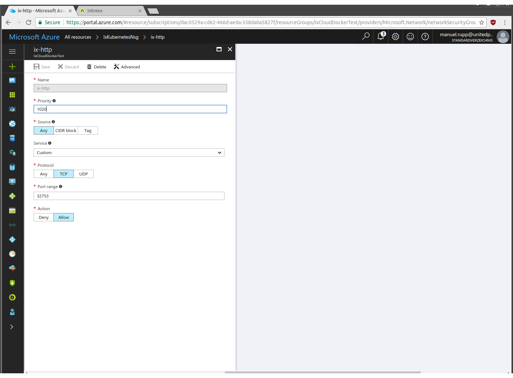

2. Create load balancer

- Name: IxKubernetesLb
- Type: Public
- Resource Group: Existing

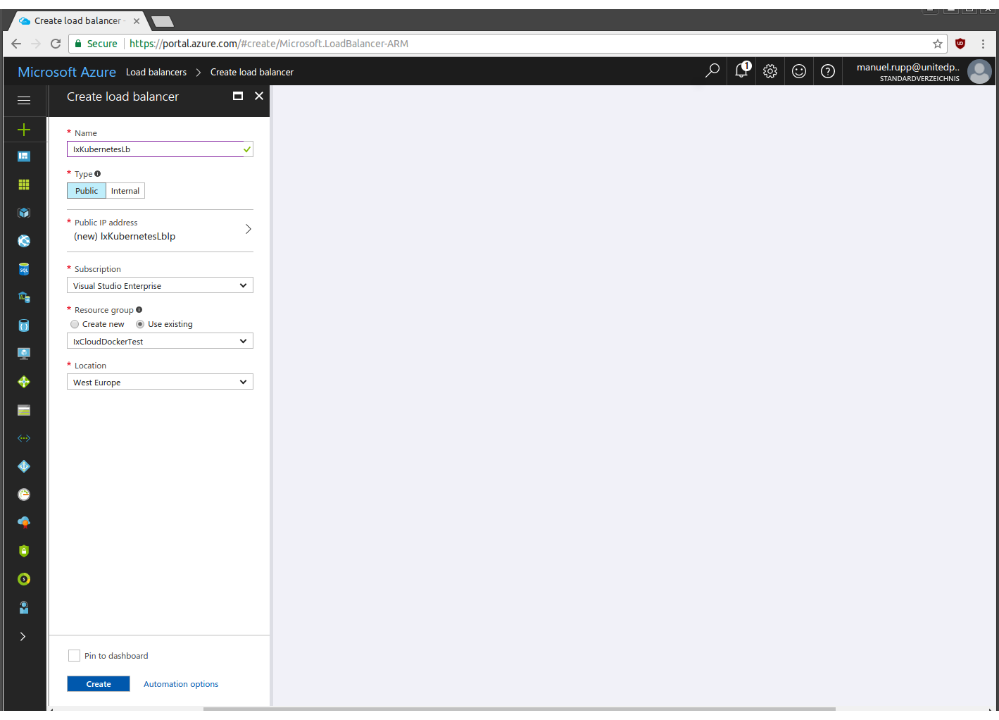

3. Add health probe

- Name: IxKubernetesLbHealthProbe
- Protocol: HTTP
- Port: 32753 (node port of portalserver service)
- Path: /cloud/default.ixsp


4. Create backend pool

- Name: IxKubernetesLbBackend
- Associate To: IxKubernetesAvailSet
- Target IP configs: Agent1, Agent2, ...

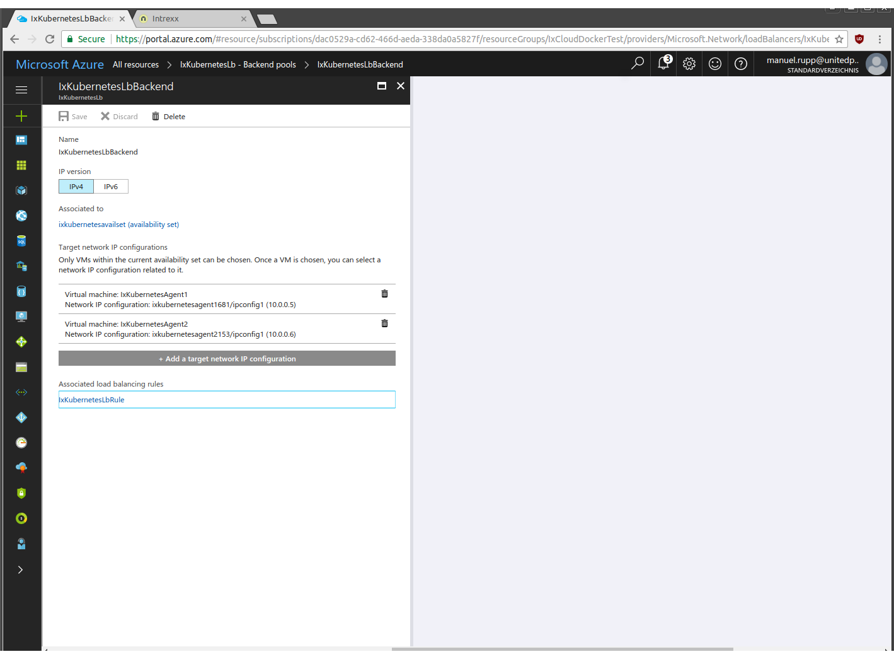

5. Create load balancer rules

Load balancing rule:

- Name: IxKubernetesLbRule
- Frontend IP: LoadBalancer Public IP
- Protocol: TCP
- Port: 80
- Backend pool: IxKubernetesLbBackend
- Health probe: IxKubernetesLbHealthProbe
- Session persistence: None
- Timout: 4
- Floating IP: disabled

Inbound NAT rule:

- Name: IxKubernetesLbManagerRule
- Frontend IP: LoadBalancer Public IP
- Protocol: TCP
- Port: 8101
- Target Port: xxxxx (get manager port from `kubectl get services`)
- Floating IP: disabled

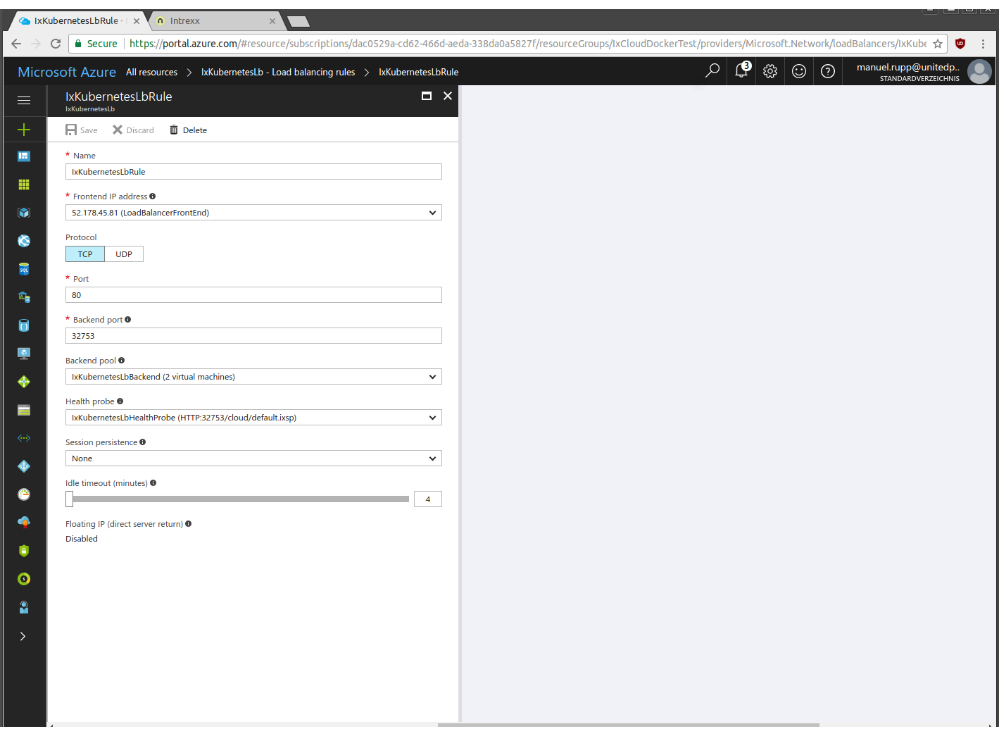

6. Open portal in browser

http://your-lb-public-ip/cloud/default.ixsp

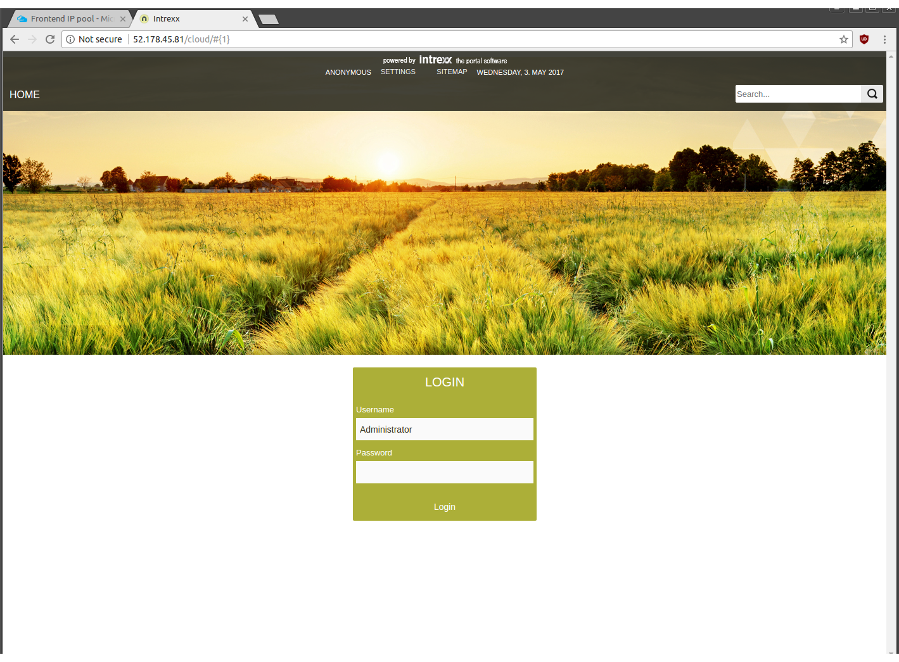

### Check Intrexx Connectivity

After the deployment, the health of Intrexx can be verified by entering the IP (external IP of the load balancer) into the browser.

## Setting up a Kubernetes Cluster with Amazon AWS EKS

Amazon Web Services offer with Elastic Kubernetes Service (EKS) a managed Kubernetes cluster which is fully integrated with other AWS services like Elastic Load Balancer or Elastic Block Storage. The following chapter describes the steps to set up an EKS cluster and deploy Intrexx portals on it.

### Create EKS stack

The required steps to set up an EKS cluster is explained here: (https://docs.aws.amazon.com/en_us/eks/latest/userguide/getting-started.html)

First of all, follow the tasks in the guide to create an EKS service role and then the cluster VPC. Record the SubnetIds for the subnets that were created. You need this when you create your EKS cluster; these are the subnets that your worker nodes are launched into.

### Create a dedicated Linux instance as a jump host

This step is optional but highly recommended. In order to control your EKS cluster you can either use the required tools locally on your machine (MacOS or Linux) as mentioned in the AWS getting started guide or you can launch a dedicated Linux VM instance in your cluster VPC and allow SSH access to this instance from your public IP. This is required if you want to build your own Intrexx container images instead of using the prebuilt images from United Planet. All further CLI commands will be executed from this machine.

Instance details:

* OS: Ubuntu 18.04 LTS
* AWS Instance: t2.small (at least 1 CPU und 2 GB RAM required for building Docker images)
* Public IP assigned
* VPC: same as the EKS VPS
* Subnet: Choose the first created subnet from the output of the EKS stack

When the instance is up and running, connect via SSH and user ubuntu and execute the following commands:

```bash
sudo apt-get update
sudo apt-get upgrade -y
sudo apt-get install python3 python-pip git -y
sudo apt-get install nfs-common -y
sudo apt-get install postgresql-client -y
```

### Install and Configure kubectl and AWS CLI for Amazon EKS 

On the Linux VM, proceed with the installation of AWS CLI, kubectl and aws-iam-authenticator for EKS as described in the getting started guide.

```bash
curl -o kubectl https://amazon-eks.s3-us-west-2.amazonaws.com/1.10.3/2018-07-26/bin/linux/amd64/kubectl
chmod +x ./kubectl
mkdir $HOME/bin && cp ./kubectl $HOME/bin/kubectl && export PATH=$HOME/bin:$PATH
echo 'export PATH=$HOME/bin:$PATH' >> ~/.bashrc
source ~/.bash_profile
kubectl version --short --client

curl -o aws-iam-authenticator https://amazon-eks.s3-us-west-2.amazonaws.com/1.10.3/2018-07-26/bin/linux/amd64/aws-iam-authenticator
chmod +x ./aws-iam-authenticator
cp ./aws-iam-authenticator $HOME/bin/aws-iam-authenticator && export PATH=$HOME/bin:$PATH
echo 'export PATH=$HOME/bin:$PATH' >> ~/.bashrc
source ~/.bash_profile
aws-iam-authenticator help

pip install awscli --upgrade --user
echo 'export PATH=~/.local/bin:$PATH' >> ~/.bashrc
source ~/.bash_profile
aws --version
```

### Clone the United Planet cloud-playbooks repository

Our cloud-playbooks repository on GitHub contains the latest configuration and deplyoment files for creating the Docker images and deploying Intrexx on Kubernetes.

```bash
git clone https://github.com/UnitedPlanet/intrexx-cloud-playbooks/

cd intrexx-cloud-playbooks/kubernetes/linux/kubernetes/aws_eks
```

### Create EKS worker nodes cluster

Now proceed with "Step 1: Create Your Amazon EKS Cluster" in the AWS EKS getting started guide, then "Step 2: Configure kubectl for Amazon EKS" followed by "Step 3: Launch and Configure Amazon EKS Worker Nodes". Remember that all CLI commands have to be executed on the Linux jump host VM. At the end of step 3 you should see the Kubernetes worker nodes when executing the command:

```bash
kubectl get nodes
```

### Create AWS RDS Postgresql instance

For the portal server database a RDS Postgresql instance is required. Follow these steps to create one:

* Open the RDS console in the AWS web console.
* Click on "Create database" and select Postgresql engine.
* Choose an instance specification according to your requirements (db.t2.micro is enough for testing/demo purposes)
* Choose an unique db instance name and an user/password for the Intrexx database.
* In the next step, select the same VPC/subnet group as your EKS cluster. Uncheck public availability, choose create a new security group.
* Unter database name, enter 'ixcloud' as name.
* Leave all other options as is and create the database instance.
* After the database has been created, check the newly created security group for the database and add the following inbound rule to allow access from your Kubernetes cluster (we assume that 192.168.0.0 is the EKS cluster subnet IP range):

```text
PostgreSQL
TCP
5432
192.168.0.0/16
```

### Create AWS EFS filesystem instance

Every portal service instance in the cluster needs access to the shared portal folder filesystem. We recommend using AWS Elastic file system for this. Follow these steps to create one:

* Open the EFS console in the AWS web console.
* Create a new filesystem and choose the EKS VPC and the assign the three Subnet IDs from the EKS VPC. Remember the chosen security group.
* Leave all other options as recommended by AWS and create the filesystem.


### Check RDS and EFS connections

Back on the Linux VM shell, you should check now that connections from the EKS subnets to the database and filesystem are working.

* Mount the portal folder share (replace the EFS endpoint URL in the example with your one):

```bash
sudo mkdir /share
sudo mount -t nfs4 -o nfsvers=4.1,rsize=1048576,wsize=1048576,hard,timeo=600,retrans=2,noresvport fs-xxxxx.efs.eu-west-1.amazonaws.com:/ /share/
```

Verify that the filesystem is correctly mounted to `/share`.

* Connect to the database (replace the RDS database URL in the example with your one):

```bash
 psql -h ixekstestdb.xxxxxxxx.eu-west-1.rds.amazonaws.com -U ixadmin -d ixcloud
```

You should be able to connect and see a list of the existing databases with command `\l`. Now exit the Postgresql client with `\q`.

### Deploy Intrexx containers

Follow the same steps as desribed in the Azure chapter.

## Cluster operations

### Running a supervisor node for portal manager sessions

When it comes to connect with the Portal Manager, we must add a rule for the soap connector ports to the Azure network security group.

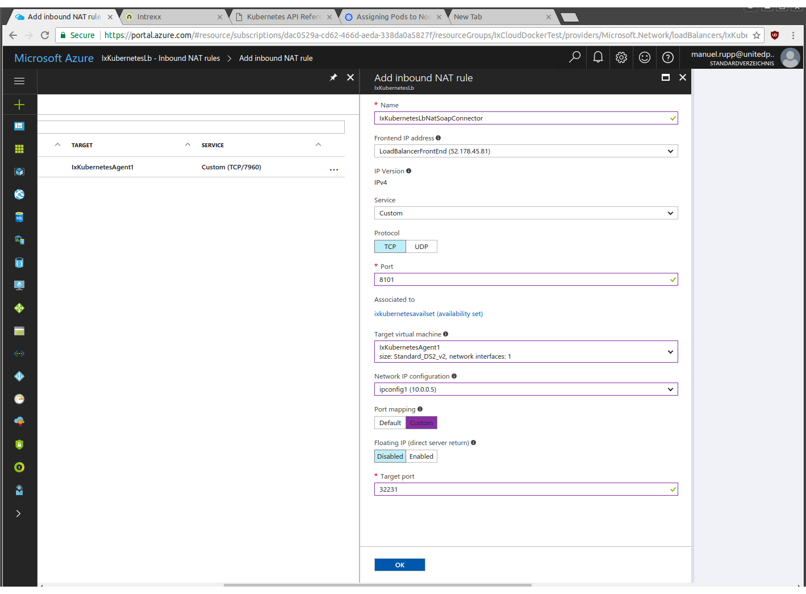

Create a NAT rule for port 8101 (the target port of the soap connector service). Choose one of the agent nodes IP addresses as target ip.

When the rules are created, the portal manager should be able to connect to the portal server instance. In portal manager, click on `Connect with server` and register the public IP address of your Azure load balancer.

### Scaling out and in

To scale portal server instances in and out, change the value of the `replicas` property in `appserver.yaml` and apply the changes.

```yaml
apiVersion: apps/v1beta1
kind: Deployment
metadata:
  name: ixcloud-deployment
spec:
  replicas: 2
  ...
```

```bash
kubectl apply -f appserver.yaml
```

### Rolling updates

Kubernetes deployments provide the ability to apply software updates to a running cluster without restarting all instances at once. Currently an Intrexx update would take the following steps:

1. Build new portalserver image including the online updates and tag it with the current Intrexx version (e.g. ixcloud:20.03.1 for OU1).
2. Upload the image to the container registry.
3. Update the image version tag in the Kubernetes deployment descriptors.
4. Follow the instructions [here](https://kubernetes.io/docs/concepts/workloads/controllers/deployment/) to restart and update the portal server instances in Kubernetes. Kubernetes will start and kill instances in such a way that there are always enough instances running to serve requests during the update process.
5. Run a new portal server manager pod and execute an interactive bash console in the pod. On the terminal, call the shell scripts to download and apply online updates to the shared portal folder and database. Wait until the job has finished, then exit and kill the pod.

## Upgrade from Intrexx 19.03/19.09

TBD 

## Appendix

### Persistent shared volumes

- TBD: portworx.com
- TBD: Glusterfs